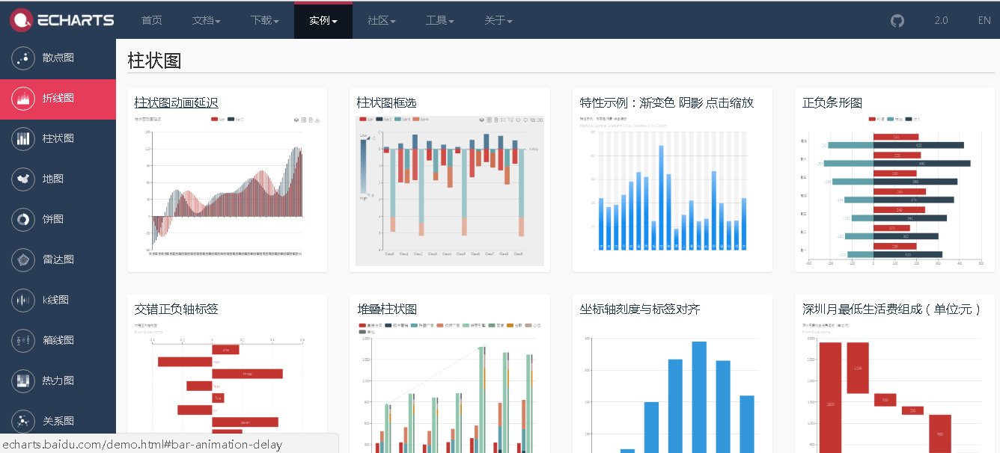
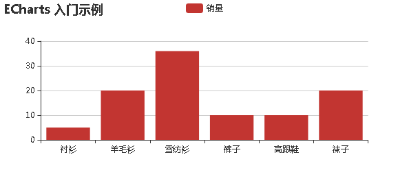
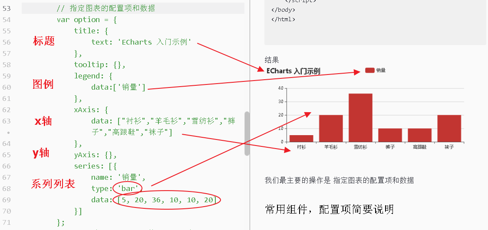

# ECharts

ECharts 是百度的开源的数据可视化JS库
官方网站：http://echarts.baidu.com/

借助Echarts，我们可以很轻易地漂亮地展现我们的数据



教程请看官方文档，如果一些概念比较难理解可以看下慕课网的Echarts入门教程
> 5 分钟上手 ECharts http://echarts.baidu.com/tutorial.html#5%20%E5%88%86%E9%92%9F%E4%B8%8A%E6%89%8B%20ECharts
Echarts配置项手册
http://echarts.baidu.com/option.html
官方实例大全 http://echarts.baidu.com/examples.html
慕课网 Echarts3.0入门基础与实战 http://www.imooc.com/learn/687

---

### Echarts的特性
1. 丰富的图表类型
2. 多个坐标系的支持
3. 移动端的优化
4. 深度的交互式数据探索
5. 大数据量的展现
6. 多维数据的支持以及丰富的视觉编码手段
7. 动态数据
8. 绚丽的特效

### 绘制一个简单的图表
步骤：
1. 引入 echarts.js
2. 为ECharts准备一个具备大小（宽高）的Dom
3. 基于准备好的dom，初始化echarts实例
4. 指定图表的配置项和数据
5. 使用刚指定的配置项和数据显示图表。

```
<!DOCTYPE html>
<html>
<head>
    <meta charset="utf-8">
    <title>ECharts</title>
    <!-- 引入 echarts.js -->
    <script src="echarts.min.js"></script>
</head>
<body>
    <!-- 为ECharts准备一个具备大小（宽高）的Dom -->
    <div id="main" style="width: 600px;height:400px;"></div>
    <script type="text/javascript">
        // 基于准备好的dom，初始化echarts实例
        var myChart = echarts.init(document.getElementById('main'));

        // 指定图表的配置项和数据
        var option = {
            title: {
                text: 'ECharts 入门示例'
            },
            tooltip: {},
            legend: {
                data:['销量']
            },
            xAxis: {
                data: ["衬衫","羊毛衫","雪纺衫","裤子","高跟鞋","袜子"]
            },
            yAxis: {},
            series: [{
                name: '销量',
                type: 'bar',
                data: [5, 20, 36, 10, 10, 20]
            }]
        };
        // 使用刚指定的配置项和数据显示图表。
        myChart.setOption(option);
    </script>
</body>
</html>
```

结果


我们最主要的操作是 指定图表的配置项和数据

### 常用组件，配置项简要说明



我们可以往 option 里边填充多个组件，配置项和数据
关于配置项请参考官方配置项参考手册http://echarts.baidu.com/option.html

每个组件有它们各自的属性，以下做简要介绍下组件

+ title
标题组件，包含主标题和副标题。

+ legend
图例组件。
图例组件展现了不同系列的标记(symbol)，颜色和名字。可以通过点击图例控制哪些系列不显示。

+ grid
直角坐标系内绘图网格，单个 grid 内最多可以放置上下两个 X 轴，左右两个 Y 轴。可以在网格上绘制折线图，柱状图，散点图（气泡图）。

+ xAxis
直角坐标系 grid 中的 x 轴，一般情况下单个 grid 组件最多只能放上下两个 x 轴，多于两个 x 轴需要通过配置 offset 属性防止同个位置多个 x 轴的重叠。

+ yAxis
直角坐标系 grid 中的 y 轴，一般情况下单个 grid 组件最多只能放左右两个 y 轴，多于两个 y 轴需要通过配置 offset 属性防止同个位置多个 Y 轴的重叠。

+ polar
极坐标系，可以用于散点图和折线图。每个极坐标系拥有一个角度轴和一个半径轴。

+ radar
雷达图坐标系组件，只适用于雷达图。该组件等同 ECharts 2 中的 polar 组件。因为 3 中的 polar 被重构为标准的极坐标组件，为避免混淆，雷达图使用 radar 组件作为其坐标系。

+ dataZoom[i]
dataZoom 组件 用于区域缩放，从而能自由关注细节的数据信息，或者概览数据整体，或者去除离群点的影响。

+ tooltip
提示框组件。

+ toolbox
工具栏。内置有导出图片，数据视图，动态类型切换，数据区域缩放，重置五个工具。

+ brush
brush 是区域选择组件，用户可以选择图中一部分数据，从而便于向用户展示被选中数据，或者他们的一些统计计算结果。

+ geo
地理坐标系组件。
地理坐标系组件用于地图的绘制，支持在地理坐标系上绘制散点图，线集。

+ timeline
timeline 组件，提供了在多个 ECharts option 间进行切换、播放等操作的功能。

+ series[i]
系列列表。每个系列通过 type 决定自己的图表类型.

图形类型:
line 折线/面积图
bar 柱状/条形图
pie 饼图
scatter 散点（气泡）图
effectScatter 带有涟漪特效动画的散点（气泡）图
radar 雷达图
boxplot 中文可以称为『箱形图』
candlestick k线图
heatmap 热力图
map 地图

+ color
调色盘颜色列表。如果系列没有设置颜色，则会依次循环从该列表中取颜色作为系列颜色。

+ backgroundColor
背景色，默认无背景。

+ textStyle
全局的字体样式。

+ animation
是否开启动画。

### 异步数据加载和更新
ECharts 中实现异步数据的更新非常简单，在图表初始化后不管任何时候只要通过 jQuery 等工具异步获取数据后通过 setOption 填入数据和配置项就行。

```
var myChart = echarts.init(document.getElementById('main'));
// 显示标题，图例和空的坐标轴
myChart.setOption({
    title: {
        text: '异步数据加载示例'
    },
    tooltip: {},
    legend: {
        data:['销量']
    },
    xAxis: {
        data: []
    },
    yAxis: {},
    series: [{
        name: '销量',
        type: 'bar',
        data: []
    }]
});

// 异步加载数据
$.get('data.json').done(function (data) {
    // 填入数据
    myChart.setOption({
        xAxis: {
            data: data.categories
        },
        series: [{
            // 根据名字对应到相应的系列
            name: '销量',
            data: data.data
        }]
    });
});
```


----

imooc的ECharts入门教程

* 浏览器画图原理
    - [svg](01/svg.html)
    - [canvas](01/canvas.html)
* 第一个例子
    - [柱状图](02/bar.html)
    - [折线图](02/line.html)
* 常用的组件
    - [标题](03/title.html)
    - [工具栏](03/toolbox.html)
    - [提示框](03/tooltip.html)
    - [标记](03/mark.html)、
* 其他常用图标
    - [饼图](04/pie.html)
    - [仪表图](04/gauge.html)
    - [地图](04/map.html)
    - [散点图](04/scatter.html)
    - [K线图](04/kline.html)
    - [雷达图](04/radar.html)
* 可视化功能组件
    - [多个坐标系](05/yaxis.html)
    - [x轴区域显示](05/datazoom.html)
    - [值域漫游](05/datarange.html)
    - [定制主题](05/theme.html)
* 练习项目
    - [步骤1](06/step1.html)
    - [步骤2](06/step2.html)
    - [步骤3](06/step3.html)
    - [步骤4](06/step4.html)
    - [步骤5](06/step5.html)
    - [最终效果](06/beijing.html)
