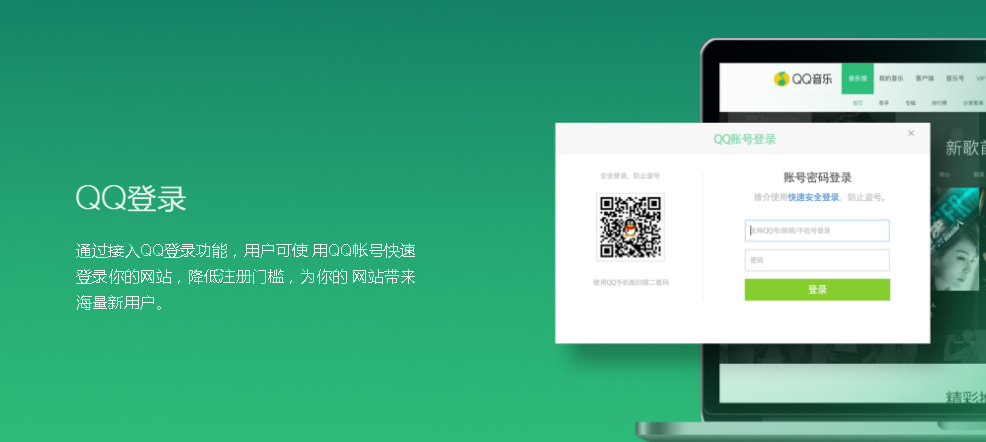
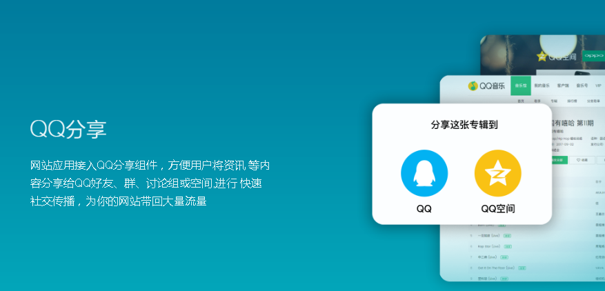
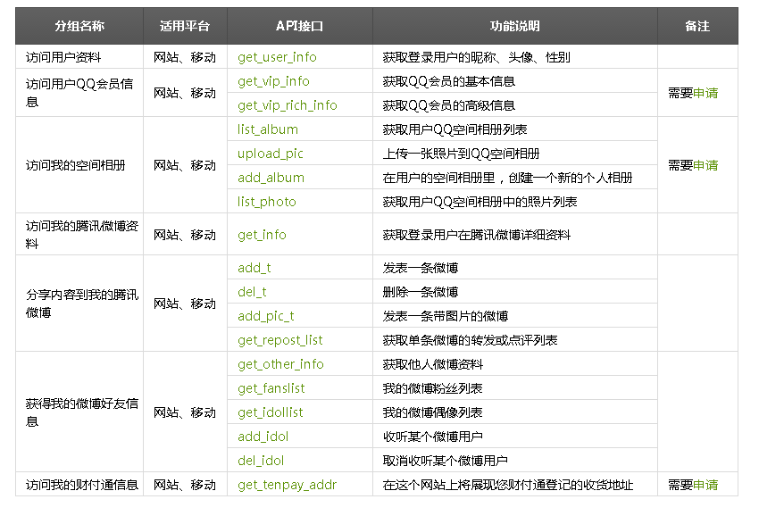
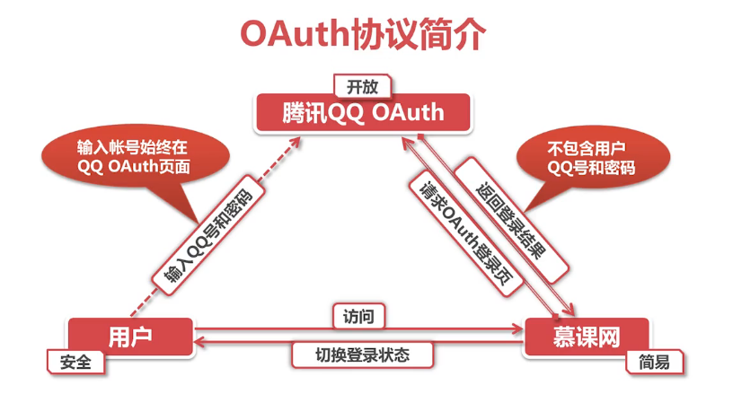
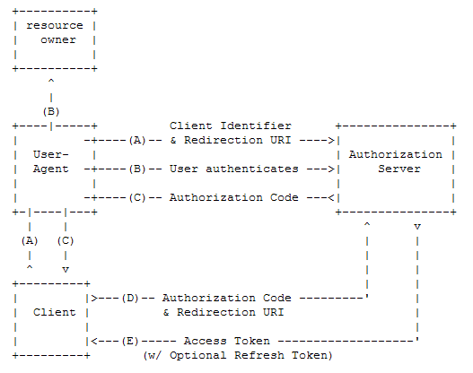

## OAuth2.0协议

> **资料** 
第三方登录—OAuth2.0协议
http://www.imooc.com/learn/557
阮一峰的网络日志 理解OAuth 2.0
http://www.ruanyifeng.com/blog/2014/05/oauth_2_0.html
OAuth 2.0官方文档 https://oauth.net/2/

-----

### OAuth是什么

OAuth is a short for Open Authorization.

OAuth 协议**为用户资源的授权**提供了一个安全，开放而又简易的标准。

OAuth： OAuth（开放授权）是一个开放标准，允许用户授权第三方网站访问他们存储在另外的服务提供者上的信息，而不需要将用户名和密码提供给第三方网站或分享他们数据的所有内容。

OAuth1.0 发布于2007年，发生过一些安全问题，所以一般不用

OAuth2.0 发布于2010年，在现在有广泛的应用

### OAuth的应用场景

典型应用：
用户可通过QQ登录第三方网站，分享内容到QQ空间等

文档参考：
> QQ互联 网站应用接入概述
http://wiki.connect.qq.com/%E7%BD%91%E7%AB%99%E5%BA%94%E7%94%A8%E6%8E%A5%E5%85%A5%E6%B5%81%E7%A8%8B#top

例如：
QQ用户授权慕课网使用其QQ帐号的相关信息
获取授权后，在符合权限规则的情况下访问各种API

### OAuth的工作原理

**以QQ登录为例介绍：**

QQ登录OAuth2.0总体处理流程如下：

Step1：申请接入，获取appid和apikey；
Step2：开发应用，并设置协作者帐号进行测试联调；
Step3：放置QQ登录按钮；
Step4：通过用户登录验证和授权，获取Access Token；
Step5：通过Access Token获取用户的OpenID；
Step6：调用OpenAPI，来请求访问或修改用户授权的资源。

关键：

1. 第三方网站需要先去QQ互联注册和认证，获取appid和apikey
2. 用户登录QQ OAuth页面，这个页面是QQ互联的，而不是第三方网站的，用户输入帐号密码并授权之后，第三方网站就可以得到一个 Authorization_Code，然后通过Authorization Code获取Access Token
3. 获取了Access Token之后，第三方网站就可以凭借这个Access Token，调用API，请求用户的资源了

----

**更多学习：**
第三方登录—微博登录 http://www.imooc.com/learn/623
第三方登录—QQ登录 http://www.imooc.com/learn/596
