## Java 高并发秒杀系统

慕课网的Java高并发秒杀系统学习记录
> 原课程:<br>
Java高并发秒杀API之业务分析与DAO层 http://www.imooc.com/learn/587
Java高并发秒杀API之Service层 http://www.imooc.com/learn/631
Java高并发秒杀API之web层 http://www.imooc.com/learn/630
Java高并发秒杀API之高并发优化 http://www.imooc.com/learn/632

简介：高并发和秒杀都是当今的热门词汇，如何使用Java框架实现高并发秒杀API是该系列课程要研究的内容。

本记录更加侧重对后半部分的记录，参考了 https://github.com/codingXiaxw/seckill

---

### **业务和相关技术介绍**

**SSM的优点：**

1. 易于使用和轻量级
2. 代码低侵入性
3. 成熟的社区和用户群

**为什么要用秒杀系统来讲**

1. 秒杀业务场景具有典型的“事务”特性
2. 秒杀/红包类需求越来越常见
3. 面试常问问题

**我们需要参考的官网文档**

1. logback配置：https://logback.qos.ch/manual/configuration.html
2. spring配置：https://docs.spring.io/spring/docs/4.3.9.RELEASE/spring-framework-reference/html/
3. Mybatis配置：http://www.mybatis.org/mybatis-3/configuration.html

**秒杀业务分析**

秒杀业务的核心  ->  库存的处理

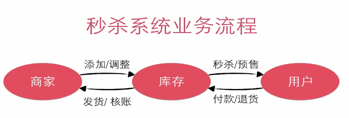

**用户针对库存业务分析**

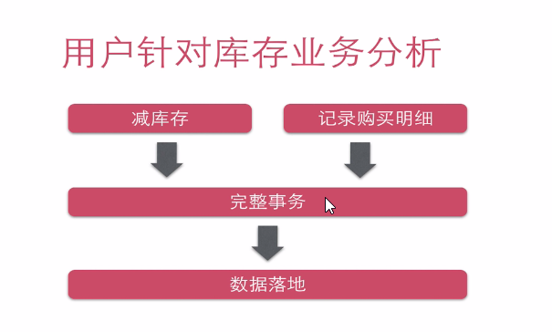

**什么是购买行为**

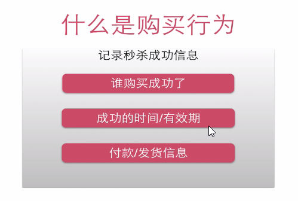

**为什么需要事务**
事务机制依然是目前最可靠的落地方案

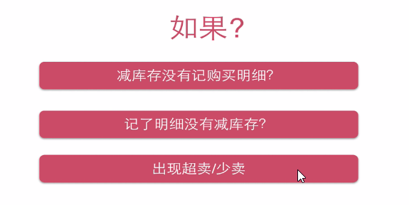

**MySQL事务**
参考：http://www.runoob.com/mysql/mysql-transaction.html

MySQL 事务主要用于处理操作量大，复杂度高的数据。

在 MySQL 中只有使用了 Innodb 数据库引擎的数据库或表才支持事务。
事务处理可以用来维护数据库的完整性，保证成批的 SQL 语句要么全部执行，要么全部不执行。
事务用来管理 insert,update,delete 语句

一般来说，事务是必须满足4个条件（ACID）： Atomicity（原子性）、Consistency（稳定性）、Isolation（隔离性）、Durability（可靠性）

MYSQL 事务处理主要有两种方法：

1、用 BEGIN, ROLLBACK, COMMIT来实现
  BEGIN 开始一个事务
  ROLLBACK 事务回滚
  COMMIT 事务确认

2、直接用 SET 来改变 MySQL 的自动提交模式:
  SET AUTOCOMMIT=0 禁止自动提交
  SET AUTOCOMMIT=1 开启自动提交

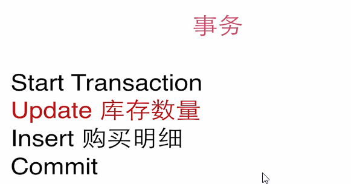

**MySQL中的行级锁,表级锁,页级锁**
http://www.cnblogs.com/wang-meng/p/5506927.html

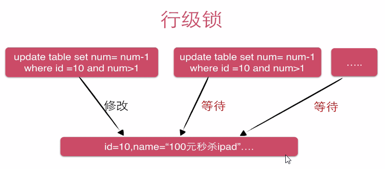

**秒杀的难点是如何高效地处理竞争**

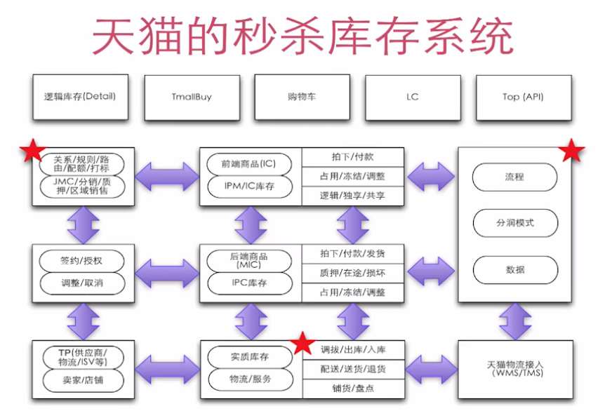


**为什么用 IOC**

1. 为对象创建统一托管
2. 规范的生命周期管理
3. 灵活的依赖注入
4. 一致的获取对象

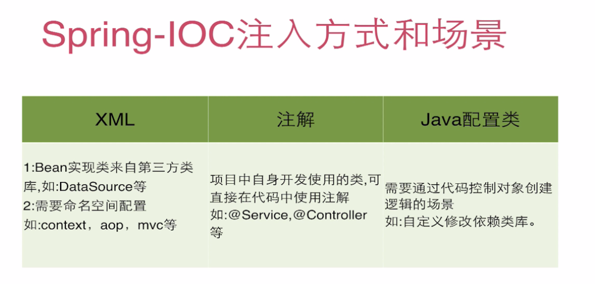

**声明式事务使用方式**

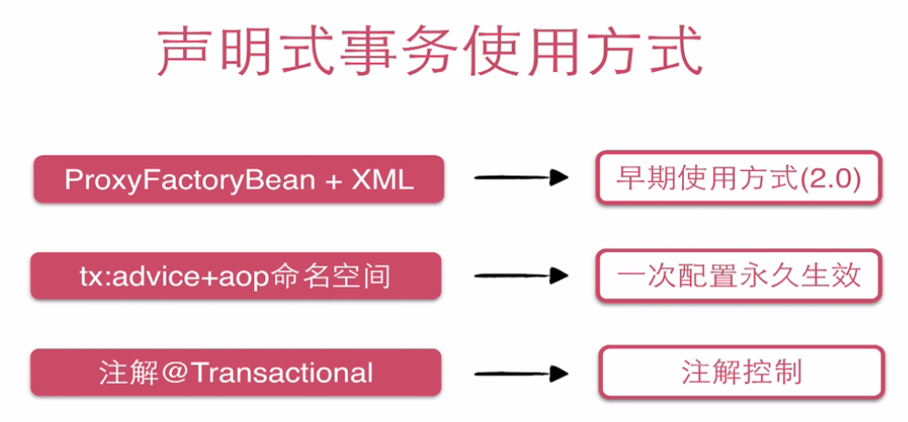
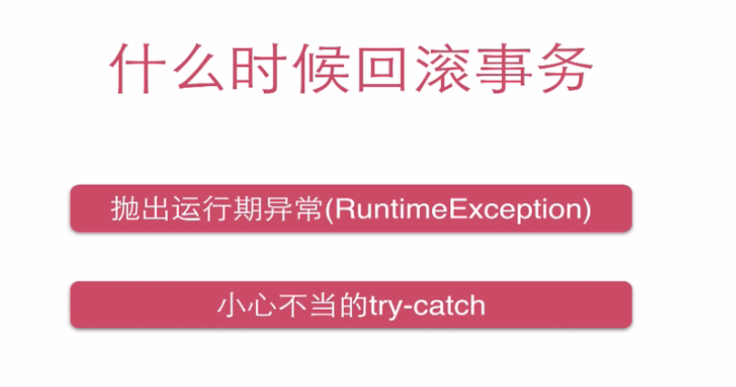
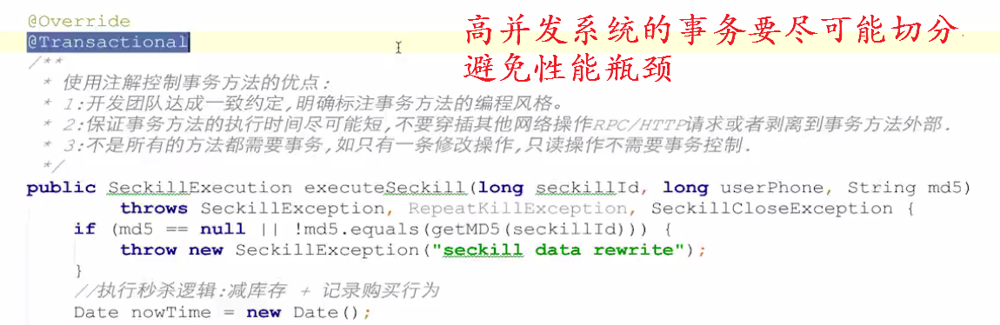

**页面流程**

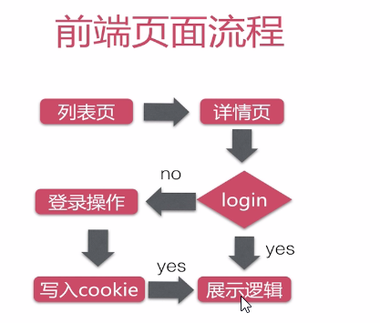

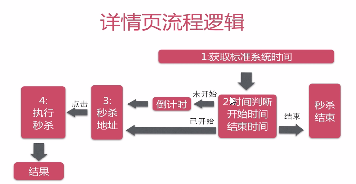

**Restful 规范**

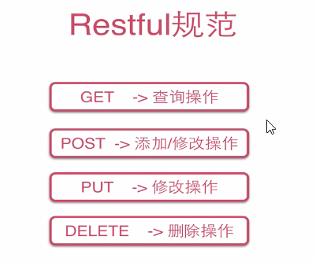

**URL 设计**

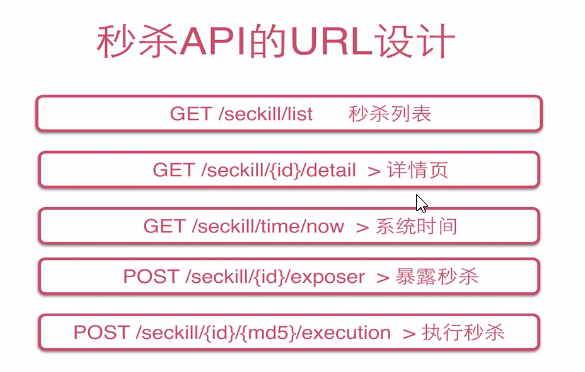

**Spring MVC 运行流程**

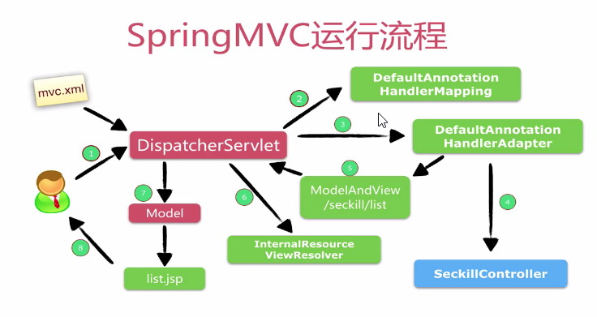


---

### **springMVC + spring + Mybatis的使用与整合**

**项目搭建**

配置好pom.xml，application.xml和web.xml

**MySQL**

表设计
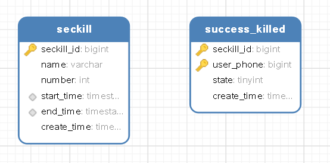

sql文件在 sql.schema.sql中


对应的Entity类
```
//-----------Seckill秒杀商品表----------------------------
package cn.codingxiaxw.entity;
import java.util.Date;
public class Seckill
{
    private long seckillId;
    private String name;
    private int number;
    private Date startTime;
    private Date endTime;
    private Date createTime;
    ...
}
//---------SuccessKilled 秒杀记录表------------------
package cn.codingxiaxw.entity;
import java.util.Date;
public class SuccessKilled
{
    private long seckillId;
    private long userPhone;
    private short state;
    private Date createTime;

    //多对一,因为一件商品在库存中有很多数量，对应的购买明细也有很多。
    private Seckill seckill;
    ...
}    
```


**设计Dao接口和编写Mybatis**
```
public interface SuccessKilledDao {
    //插入购买明细,可过滤重复
    int insertSuccessKilled(@Param("seckillId") long seckillId, @Param("userPhone") long userPhone);

    //根据秒杀商品的id查询明细SuccessKilled对象(该对象携带了Seckill秒杀产品对象)
    SuccessKilled queryByIdWithSeckill(@Param("seckillId") long seckillId,@Param("userPhone") long userPhone);
}

public interface SeckillDao
{
    //减库存
    int reduceNumber(@Param("seckillId") long seckillId, @Param("killTime") Date killTime);

    //根据id查询秒杀的商品信息
    Seckill queryById(long seckillId);

    //根据偏移量查询秒杀商品列表
    List<Seckill> queryAll(@Param("offset") int offset,@Param("limit") int limit);
}
```

**Mybatis 的 XML配置文件注意**

SuccessKill有个属性对象为Seckill对象，注意把结果映射到SuccessKill属性同时映射到Seckill属性
```
<select id="queryByIdWithSeckill" resultType="SuccessKilled">
        <!--根据seckillId查询SuccessKilled对象，并携带Seckill对象-->
        <!--如何告诉mybatis把结果映射到SuccessKill属性同时映射到Seckill属性-->

        SELECT
            sk.seckill_id,
            sk.user_phone,
            sk.create_time,
            sk.state,
            s.seckill_id "seckill.seckill_id",
            s.name "seckill.name",
            s.number "seckill.number",
            s.start_time "seckill.start_time",
            s.end_time "seckill.end_time",
            s.create_time "seckill.create_time"
        FROM success_killed sk
        INNER JOIN seckill s ON sk.seckill_id=s.seckill_id
        WHERE sk.seckill_id=#{seckillId} and sk.user_phone=#{userPhone}
    </select>
```

**Mybatis配置**

写Mybatis 和 Dao层的配置文件，并及时对Dao层进行单元测试
配置文件见 Mybatis-config.xml和spring-dao.XML


```
@RunWith(SpringJUnit4ClassRunner.class)
//告诉junit spring的配置文件
@ContextConfiguration({"classpath:spring/spring-dao.xml"})
public class SuccessKilledDaoTest {
    @Resource
    private SuccessKilledDao successKilledDao;

    @Test
    public void insertSuccessKilled() throws Exception {
        long seckillId=1000L;
        long userPhone=13476191877L;
        int insertCount=successKilledDao.insertSuccessKilled(seckillId,userPhone);
        System.out.println("insertCount="+insertCount);
    }

    @Test
    public void queryByIdWithSeckill() throws Exception {
        long seckillId=1000L;
        long userPhone=13476191877L;
        SuccessKilled successKilled=successKilledDao.queryByIdWithSeckill(seckillId,userPhone);
        System.out.println(successKilled);
        System.out.println(successKilled.getSeckill());
    }
}
```

**进行Service层的编写**

接口
```
/**业务接口:站在使用者(程序员)的角度设计接口
 * 三个方面:1.方法定义粒度，方法定义的要非常清楚2.参数，要越简练越好
 * 3.返回类型(return 类型一定要友好/或者return异常，我们允许的异常)
 * Created by codingBoy on 16/11/27.
 */
public interface SeckillService {

    /**
     * 查询全部的秒杀记录
     * @return
     */
    List<Seckill> getSeckillList();

    /**
     *查询单个秒杀记录
     * @param seckillId
     * @return
     */
    Seckill getById(long seckillId);


    //再往下，是我们最重要的行为的一些接口

    /**
     * 在秒杀开启时输出秒杀接口的地址，否则输出系统时间和秒杀时间
     * @param seckillId
     */
    Exposer exportSeckillUrl(long seckillId);


    /**
     * 执行秒杀操作，有可能失败，有可能成功，所以要抛出我们允许的异常
     * @param seckillId
     * @param userPhone
     * @param md5
     * @return
     */
    SeckillExecution executeSeckill(long seckillId,long userPhone,String md5)
            throws SeckillException,RepeatKillException,SeckillCloseException;
}
```

**获取秒杀服务接口的实现逻辑**

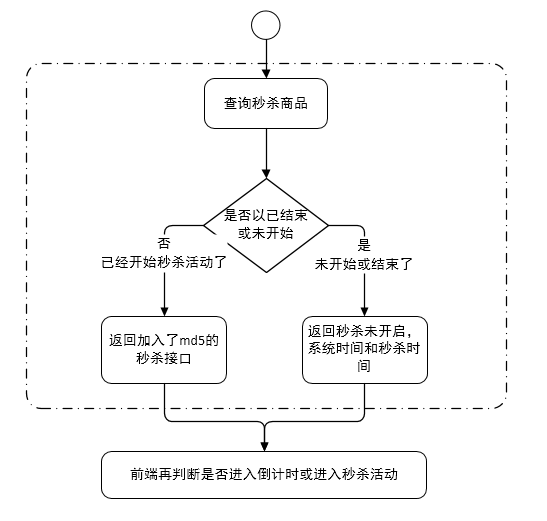

**执行秒杀操作**

注意：
秒杀成功表将 seckill_id,user_phone 设为了联合主键，所以一个当用户对同一个秒杀商品重复秒杀时不会秒杀成功
```
-- 秒杀成功明细表
-- 用户登录认证相关信息(简化为手机号)
CREATE TABLE success_killed(
  `seckill_id` BIGINT NOT NULL COMMENT '秒杀商品ID',
  `user_phone` BIGINT NOT NULL COMMENT '用户手机号',
  ...
  PRIMARY KEY(seckill_id,user_phone),/*联合主键*/
)ENGINE=INNODB DEFAULT CHARSET=utf8 COMMENT='秒杀成功明细表';
```
秒杀记录表的插入sql语句，当重复秒杀时，将发送主键冲突，返回0，由此可判断是否为重复秒杀
```
<insert id="insertSuccessKilled">
    <!--当出现主键冲突时(即重复秒杀时)，会报错;不想让程序报错，加入ignore-->
    INSERT ignore INTO success_killed(seckill_id,user_phone,state)
    VALUES (#{seckillId},#{userPhone},0)
</insert>
```

调用 reduceNumber 减库存的sql语句，会判断当前时间是否在秒杀的时间之内，如果不在，库存不会更新，秒杀失败
```
<update id="reduceNumber">
    UPDATE seckill
    SET number = number-1
    WHERE seckill_id=#{seckillId}
    AND start_time <![CDATA[ <= ]]> #{killTime}
    AND end_time >= #{killTime}
    AND number > 0;
</update>
```

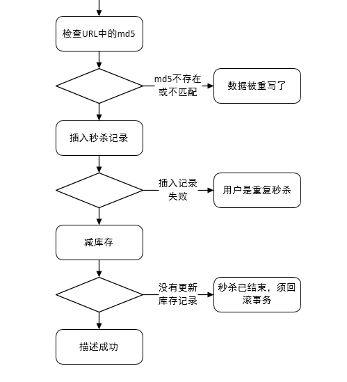


**前端的执行逻辑请看seckill.js，老师写的非常好**


------

### **编码经验总结**

**Enum的使用**

在秒杀系统中会有很多的状态的变化，我们设置状态码和相应的状态消息，为了不使状态码和状态消息混乱，将所有的状态码和状态消息写到Enum中
```
public enum SeckillStatEnum {

    SUCCESS(1,"秒杀成功"),
    END(0,"秒杀结束"),
    REPEAT_KILL(-1,"重复秒杀"),
    INNER_ERROR(-2,"系统异常"),
    DATE_REWRITE(-3,"数据篡改");

    private int state;
    private String info;

    SeckillStatEnum(int state, String info) {
        this.state = state;
        this.info = info;
    }

    public int getState() {
        return state;
    }

    public String getInfo() {
        return info;
    }

    public static SeckillStatEnum stateOf(int index)
    {
        for (SeckillStatEnum state : values())
        {
            if (state.getState()==index)
            {
                return state;
            }
        }
        return null;
    }
}
```


**自定义异常**

> 关于异常，参考：深入理解java异常处理机制
> http://blog.csdn.net/hguisu/article/details/6155636/

使用Java内置的异常类可以描述在编程时出现的大部分异常情况。除此之外，用户还可以自定义异常。用户自定义异常类，只需继承Exception类即可。


```
/**
 * 秒杀相关的所有业务异常
 * Created by codingBoy on 16/11/27.
 */
public class SeckillException extends RuntimeException {
    public SeckillException(String message) {
        super(message);
    }
    public SeckillException(String message, Throwable cause) {
        super(message, cause);
    }
}
/**
 * 重复秒杀异常，是一个运行期异常，不需要我们手动try catch
 * Mysql只支持运行期异常的回滚操作
 * Created by codingBoy on 16/11/27.
 */
public class RepeatKillException extends SeckillException {
    public RepeatKillException(String message) {
        super(message);
    }
    public RepeatKillException(String message, Throwable cause) {
        super(message, cause);
    }
}

/**
 * 秒杀关闭异常，当秒杀结束时用户还要进行秒杀就会出现这个异常
 * Created by codingBoy on 16/11/27.
 */
public class SeckillCloseException extends SeckillException{
    public SeckillCloseException(String message) {
        super(message);
    }
    public SeckillCloseException(String message, Throwable cause) {
        super(message, cause);
    }
}

```

**DTO数据传输对象**

> 博客： 浅析VO、DTO、DO、PO的概念、区别和用处
> http://blog.csdn.net/wwwdc1012/article/details/78160010

**POJO（Plain Ordinary Java Object）**:简单而言，就是一个简单的对象，而且没有任何规则约束。有的时候拿 POJO  来泛指用来做传输对象 Java bean （包括今天要介绍的 DTO  、 VO  、 BO  、 PO  等）也是可以的。

**VO（View Object）**：视图对象，用于展示层，它的作用是把某个指定页面（或组件）的所有数据封装起来。

**DTO（Data Transfer Object）**：数据传输对象，这个概念来源于J2EE的设计模式，原来的目的是为了EJB的分布式应用提供粗粒度的数据实体，以减少分布式调用的次数，从而提高分布式调用的性能和降低网络负载，但在这里，我泛指用于展示层与服务层之间的数据传输对象。

**DO（Domain Object）**：领域对象，就是从现实世界中抽象出来的有形或无形的业务实体。

**PO（Persistent Object）**：持久化对象，它跟持久层（通常是关系型数据库）的数据结构形成一一对应的映射关系，如果持久层是关系型数据库，那么，数据表中的每个字段（或若干个）就对应PO的一个（或若干个）属性。PO  不包含业务逻辑和数据逻辑。就是一个Entity 或者说 ModelEntity 。

**BO（Business Object）**:业务对象，它是和业务挂钩的，简单来说，我们每个业务可能需要很多 PO  （数据库表）来组成，而我们返回前端页面或者返回给调用方的时候，我们需要组合。而这个时候， BO  就派上用场了，它就是一个对 PO  的组合，也可以就是 PO  ，只是出发点是满足业务的传输对象。

**DAO（Data Access Object）**:数据访问对象，通常是和数据层打交道的最后一层，通过 DAO  对数据库做识别操作，最终返回我们想要的数据。通常和我们的 PO  、 BO  等基础类型，如List 、Map 等结合使用。

```
//将所有的ajax请求返回类型，全部封装成json数据
public class SeckillResult<T> {
    //请求是否成功
    private boolean success;
    private T data;
    private String error;
    public SeckillResult(boolean success, T data) {
        this.success = success;
        this.data = data;
    }
    public SeckillResult(boolean success, String error) {
        this.success = success;
        this.error = error;
    }
    ...
}
/**
 * 封装执行秒杀后的结果:是否秒杀成功
 * Created by codingBoy on 16/11/27.
 */
public class SeckillExecution {
    private long seckillId;
    //秒杀执行结果的状态
    private int state;
    //状态的明文标识
    private String stateInfo;
    //当秒杀成功时，需要传递秒杀成功的对象回去
    private SuccessKilled successKilled;
    //秒杀成功返回所有信息
    public SeckillExecution(long seckillId, SeckillStatEnum statEnum, SuccessKilled successKilled) {
        this.seckillId = seckillId;
        this.state = statEnum.getState();
        this.stateInfo = statEnum.getInfo();
        this.successKilled = successKilled;
    }
    //秒杀失败
    public SeckillExecution(long seckillId, SeckillStatEnum statEnum) {
        this.seckillId = seckillId;
        this.state = statEnum.getState();
        this.stateInfo = statEnum.getInfo();
    }
    ...
}

/**
 * Created by codingBoy on 16/11/27.
 * 暴露秒杀地址(接口)DTO
 */
public class Exposer {
    //是否开启秒杀
    private boolean exposed;
    //加密措施
    private String md5;
    private long seckillId;
    //系统当前时间(毫秒)
    private long now;
    //秒杀的开启时间
    private long start;
    //秒杀的结束时间
    private long end;
    public Exposer(boolean exposed, String md5, long seckillId) {
        this.exposed = exposed;
        this.md5 = md5;
        this.seckillId = seckillId;
    }
    public Exposer(boolean exposed, long seckillId,long now, long start, long end) {
        this.exposed = exposed;
        this.seckillId=seckillId;
        this.now = now;
        this.start = start;
        this.end = end;
    }
    public Exposer(boolean exposed, long seckillId) {
        this.exposed = exposed;
        this.seckillId = seckillId;
    }
    ...
}         
```


----

### **常用技术解决高并发问题**


**高并发集中在哪里**
(红色的部分)

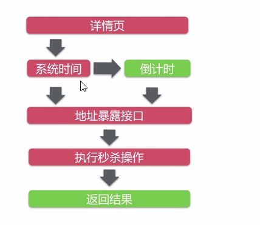

**获取系统时间接口优化分析**

获取系统时间不用优化，访问一次内存（Cacheline）大约10ns

**秒杀地址接口分析**

无法使用CDN缓存，适合服务端缓存(redis等)，一致性维护成本低

秒杀地址接口的优化
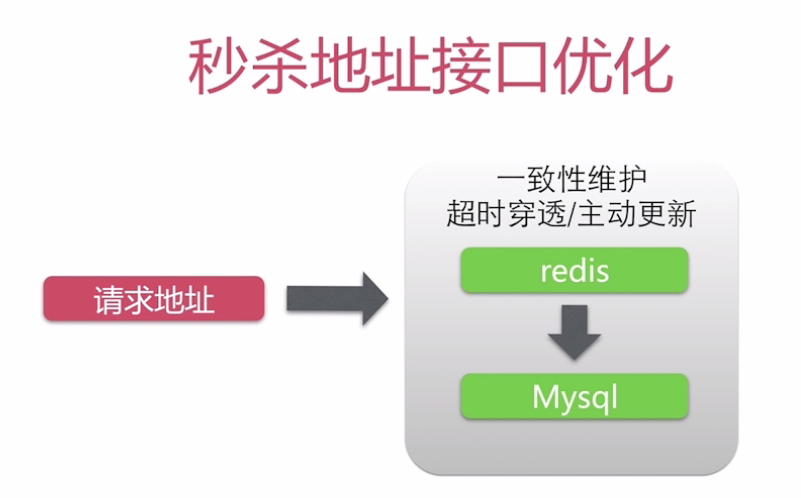


**秒杀操作优化分析**

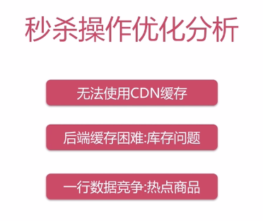

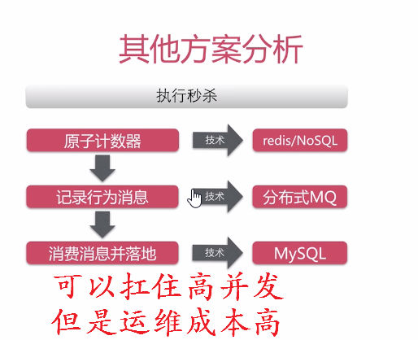

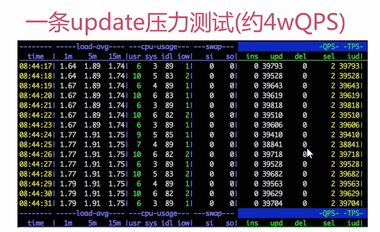

**Java控制事务行为分析**

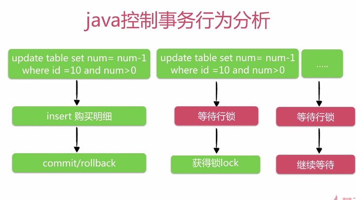

**瓶颈分析和优化分析**

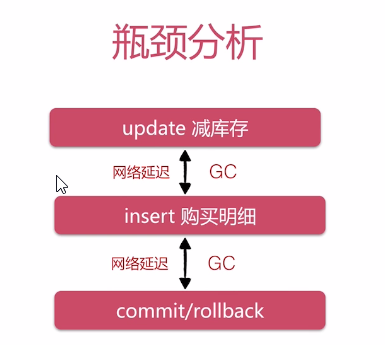

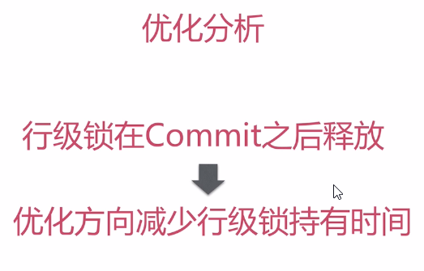

**延迟分析**

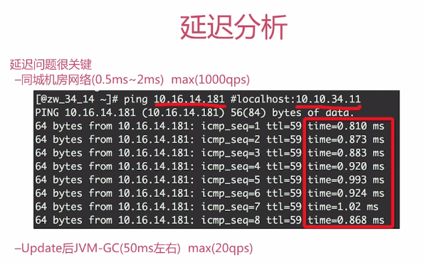
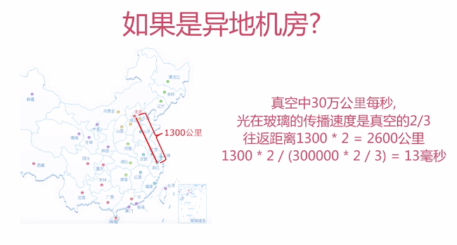

**如何判断update更新成功**

两个条件：
1. update自身没有报错
2. 客户端确认update影响记录数

优化思路：
把客户端逻辑放到MySQL服务端，避免网络延迟和GC的影响

**如何放到MySQL服务端**
两种解决方案：
1. 定制SQL方案：update /* + [AUTOCOMMIT] * ，需要修改MySQL源码
2. 使用存储过程，整个事务在MySQL端完成

**优化总结**

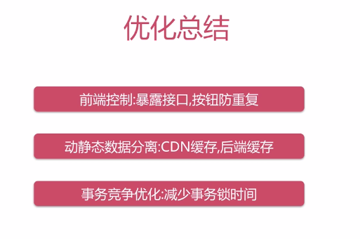

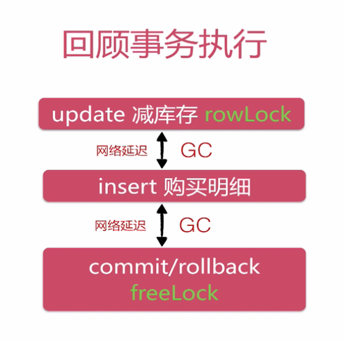

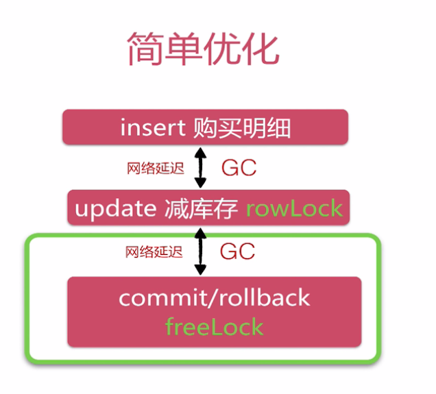

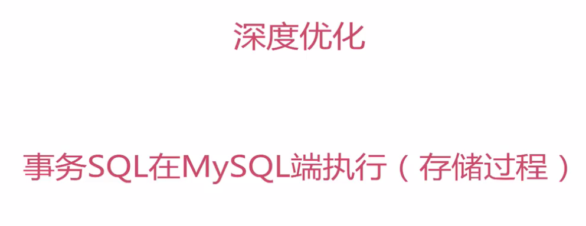

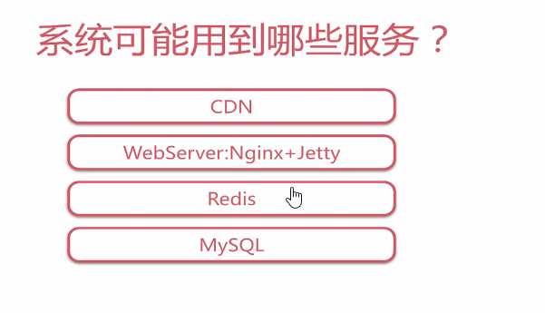

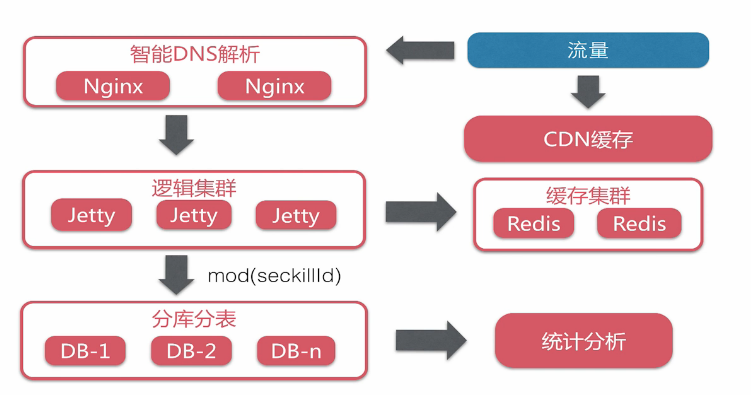

---

### **高并发优化总结**

**使用redis缓存后端数据和数据的序列化**

我们可以将秒杀商品的信息缓存到NoSQL数据库中，NoSQL是完全存在于内存中的，所以存取数据非常快

由于redis没有帮我们实现序列化，所以我们需要自己将数据序列化后再存入redis中

虽然Java有自己的序列化技术，但是这里是高并发场景，我们需要选择目前序列化效率算最高的来自google的 protostuff

> 关于序列化方法的比较，见
https://github.com/eishay/jvm-serializers/wiki

java操作redis使用 jedis ：https://github.com/xetorthio/jedis

```
public class RedisDao {
    private final JedisPool jedisPool;

    public RedisDao(String ip, int port) {
        jedisPool = new JedisPool(ip, port);
    }

    private RuntimeSchema<Seckill> schema = RuntimeSchema.createFrom(Seckill.class);

    public Seckill getSeckill(long seckillId) {
        //redis操作逻辑
        try {
            Jedis jedis = jedisPool.getResource();
            try {
                String key = "seckill:" + seckillId;
                //并没有实现哪部序列化操作
                //采用自定义序列化
                //protostuff: pojo.
                byte[] bytes = jedis.get(key.getBytes());
                //缓存重获取到
                if (bytes != null) {
                    Seckill seckill=schema.newMessage();
                    ProtostuffIOUtil.mergeFrom(bytes,seckill,schema);
                    //seckill被反序列化

                    return seckill;
                }
            }finally {
                jedis.close();
            }
        }catch (Exception e) {

        }
        return null;
    }

    public String putSeckill(Seckill seckill) {
        try {
            Jedis jedis = jedisPool.getResource();
            try {
                String key = "seckill:" + seckill.getSeckillId();
                byte[] bytes = ProtostuffIOUtil.toByteArray(seckill, schema,
                        LinkedBuffer.allocate(LinkedBuffer.DEFAULT_BUFFER_SIZE));
                //超时缓存
                int timeout = 60 * 60;//1小时
                String result = jedis.setex(key.getBytes(),timeout,bytes);

                return result;
            }finally {
                jedis.close();
            }
        }catch (Exception e) {

        }
        return null;
    }
}
```

**数据库调优**

> MYSQL存储过程作用及语法
> http://blog.csdn.net/wwwdc1012/article/details/78157989

> 存储过程的优缺点及使用场景
http://blog.csdn.net/stevendbaguo/article/details/28587419

> 面向程序员的数据库访问性能优化法则
> http://blog.csdn.net/yzsind/article/details/6059209

存储过程性能的优点，主要是**减少网络交互**

但是，有很多缺点：

a、不可移植性，每种数据库的内部编程语法都不太相同，当你的系统需要兼容多种数据库时最好不要用存储过程。

b、学习成本高，DBA一般都擅长写存储过程，但并不是每个程序员都能写好存储过程，除非你的团队有较多的开发人员熟悉写存储过程，否则后期系统维护会产生问题。

c、业务逻辑多处存在，采用存储过程后也就意味着你的系统有一些业务逻辑不是在应用程序里处理，这种架构会增加一些系统维护和调试成本

d、存储过程和常用应用程序语言不一样，它支持的函数及语法有可能不能满足需求，有些逻辑就只能通过应用程序处理。

e、如果存储过程中有复杂运算的话，会增加一些数据库服务端的处理成本，对于集中式数据库可能会导致系统可扩展性问题。

f、为了提高性能，数据库会把存储过程代码编译成中间运行代码(类似于java的class文件)，所以更像静态语言。
