## 探秘spring AOP

简介：面向切面编程（AOP）提供另外一种角度来思考程序结构，通过这种方式弥补了面向对象编程（OOP）的不足。同时AOP框架也是Spring的一个关键的组件在平时的面试中也是一个容易被询问到的知识点

> 课程地址：http://www.imooc.com/learn/869

----

### **概览**

**编程范式概览**

> 编程范式的内容很多，网易公开课上有一门斯坦福的《编程范式》课程
http://open.163.com/special/opencourse/paradigms.html

1. 面向过程编程
2. 面向对象编程
3. 函数式编程
4. 事件驱动编程
5. 面向切面编程

**AOP是什么？**

1. 是一种编程范式，不是编程语言
2. 解决特定问题，不能解决所有问题
3. 是OOP的补充，不是替代

**AOP的初衷**

**AOP的好处**

1. 集中处理某一关注点/横向逻辑
2. 可以很方便地添加/删除关注点
3. 侵入性少，增强代码可读性和可维护性

**应用场景**

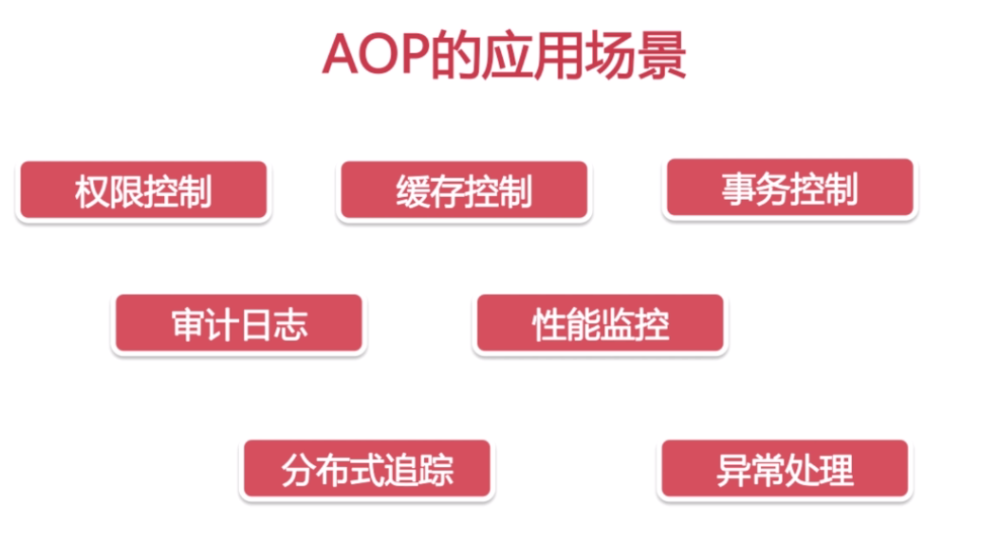

---

### **AOP使用**

**案例背景**

1. 产品管理的服务
2. 产品添加/删除的操作只能管理员才能进行
3. 普通实现VSAOP实现

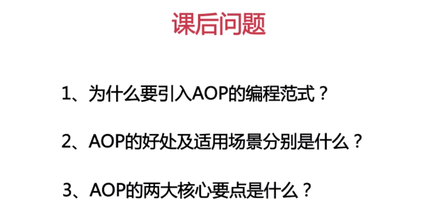

**使用方式**

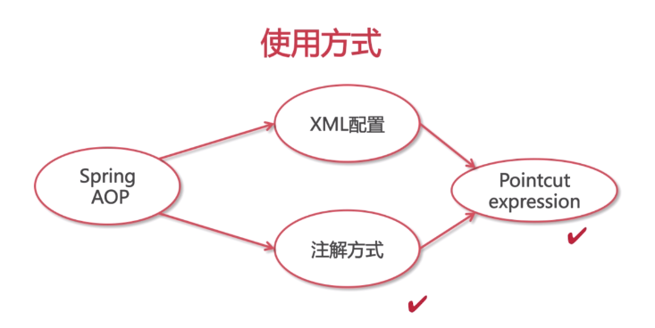

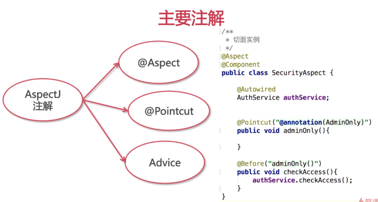

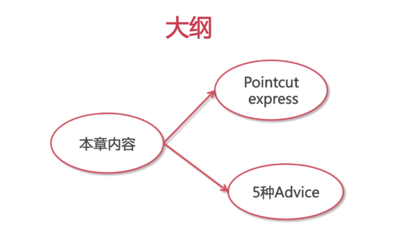

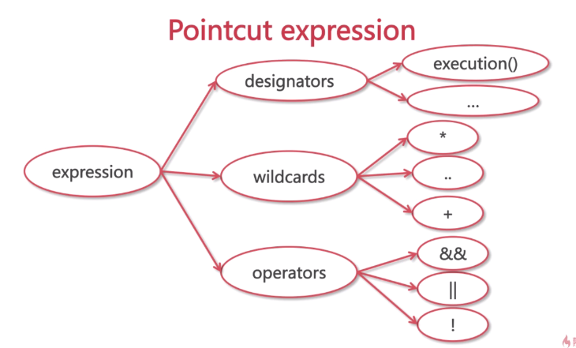

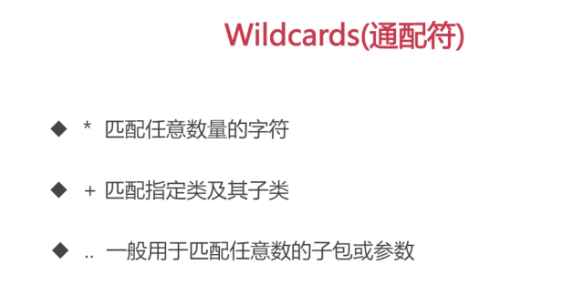

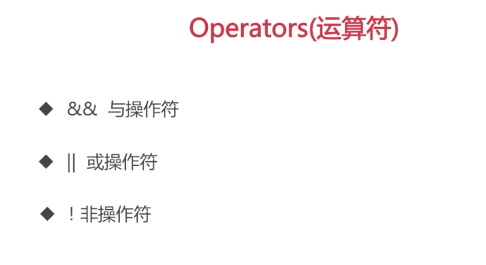

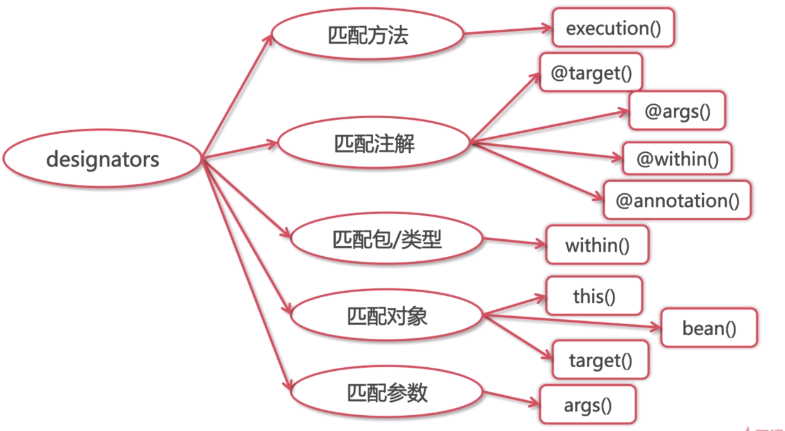

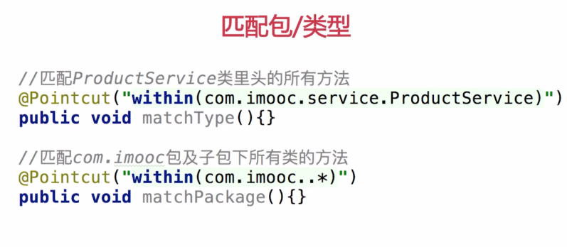

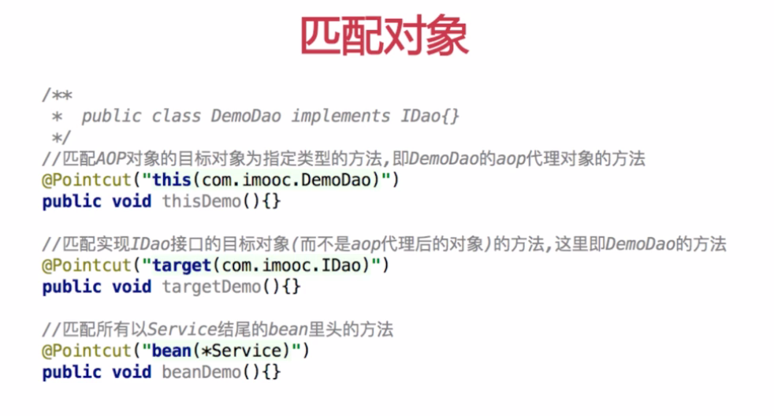

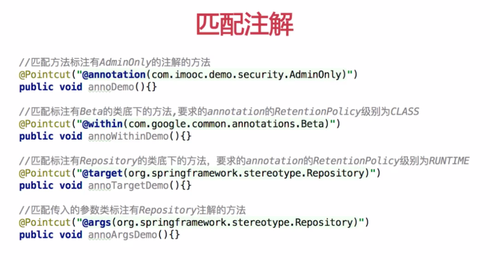

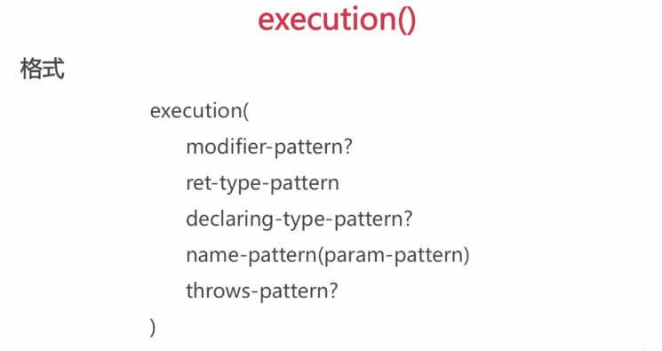

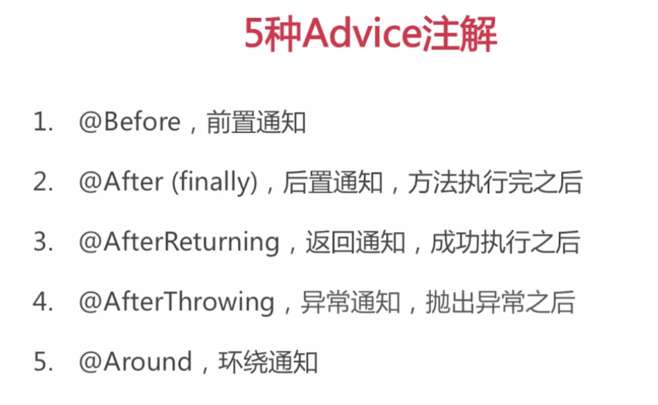

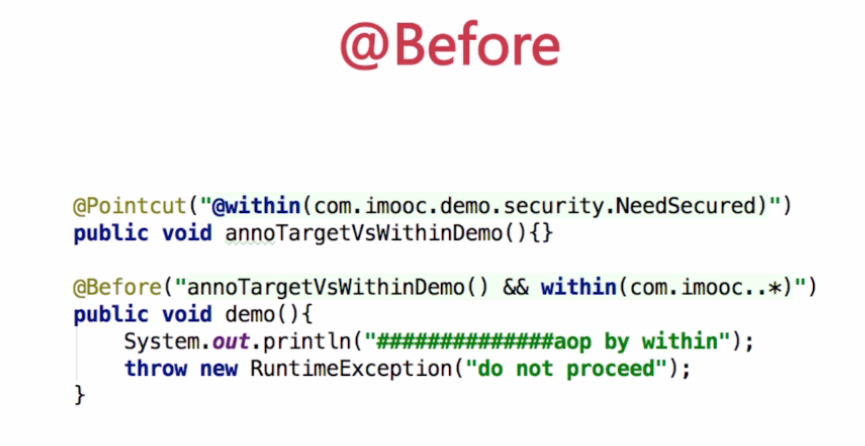

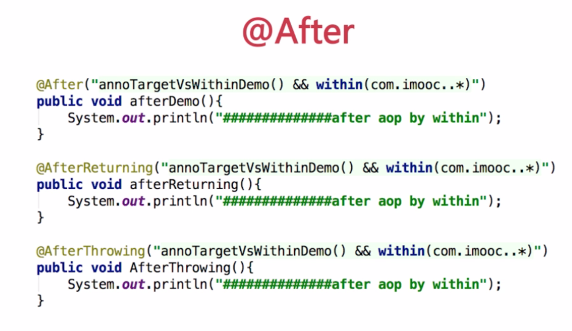

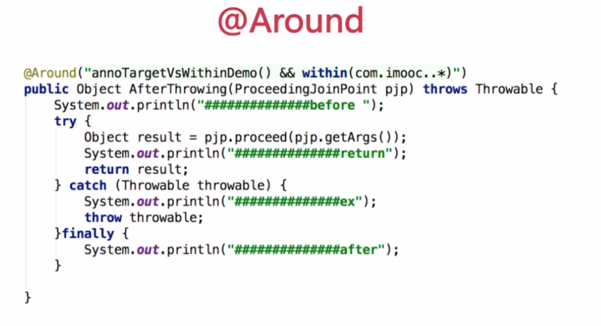

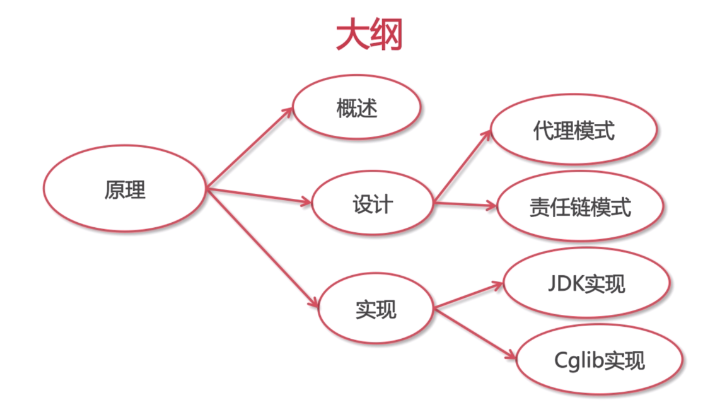

----

### **AOP原理**

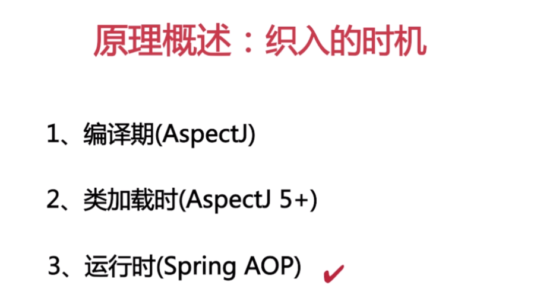

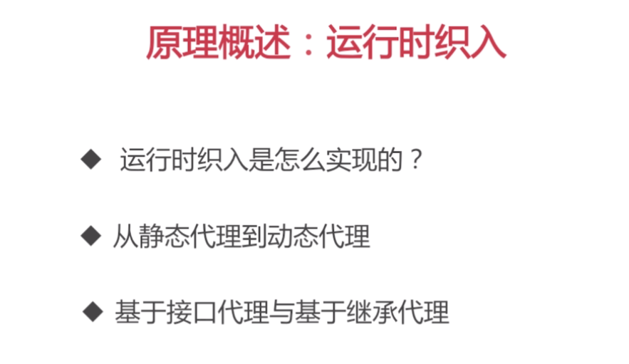

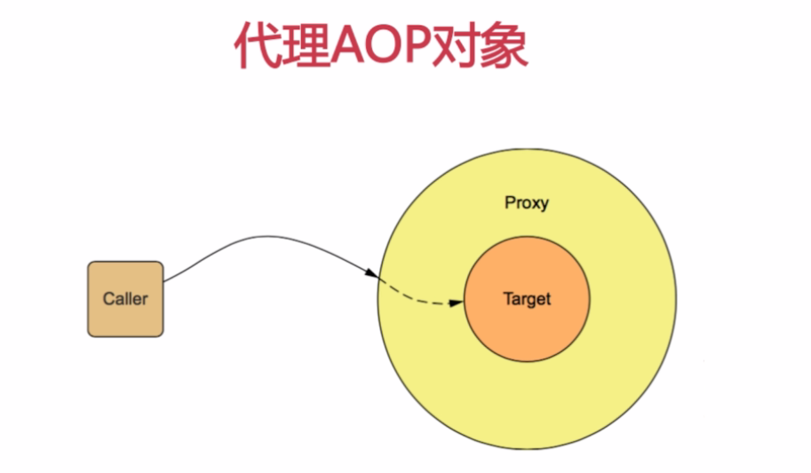

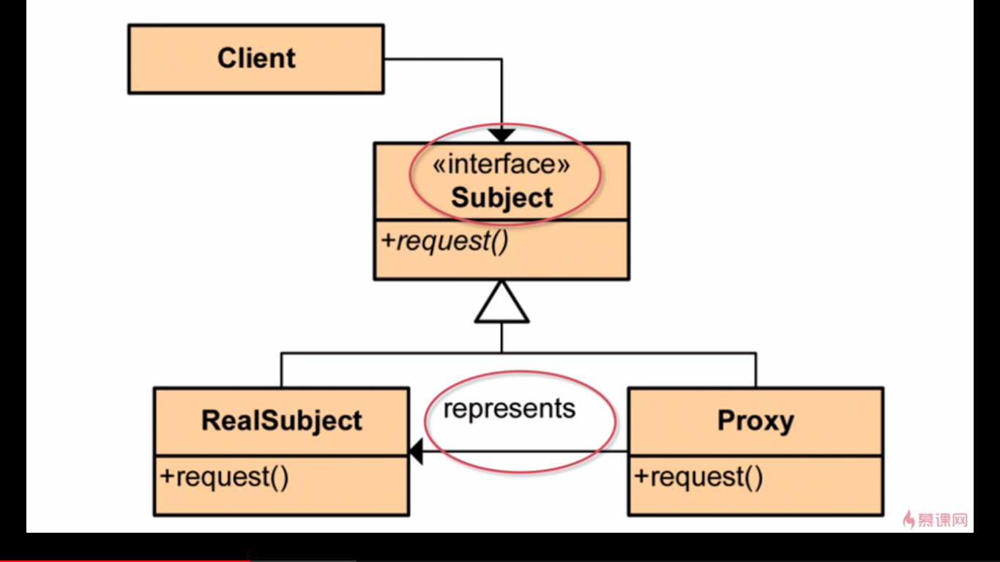

---

### **课程实战**

### **总结**
