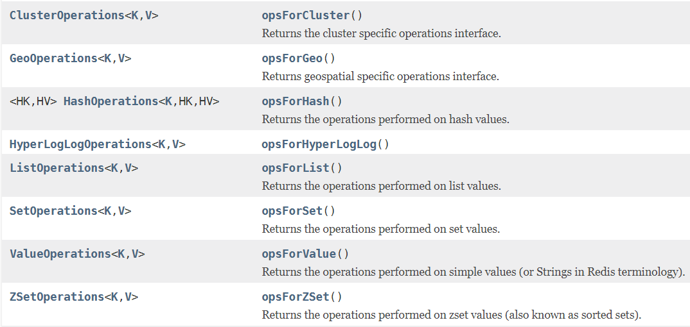
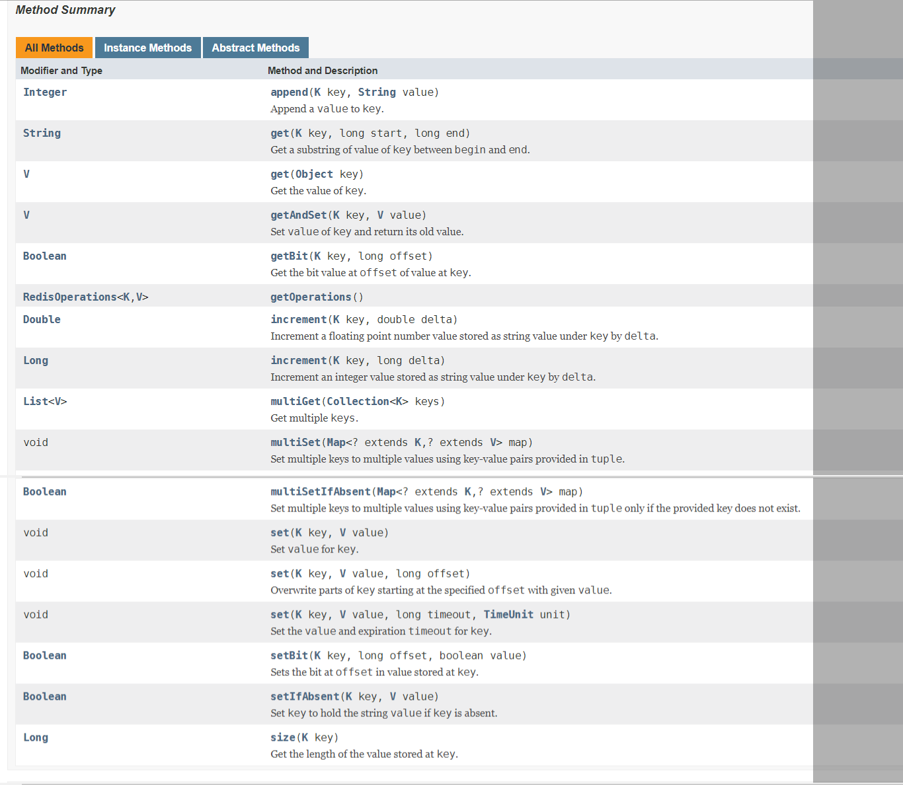
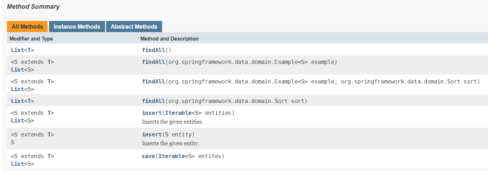
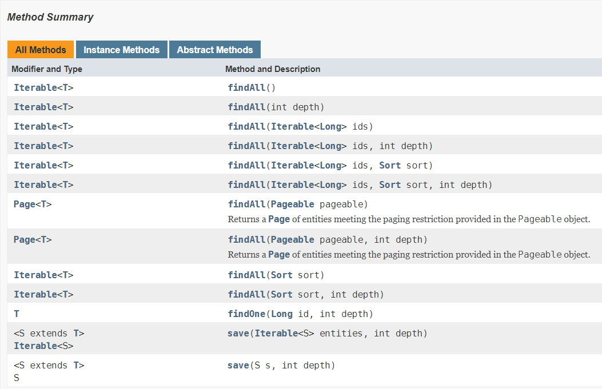

## spring boot 连接数据库 Demo

使用数据库是开发基本应用的基础。

spring boot 包含了一个功能强大的资源库，为使用 spring boot 的开发者提供了非常简便的接口进行访问，我们已经不需要写原始的 sql 语句，也不用再调用 JDBC 或连接池等称为底层的代码了。

本 Demo 将使用 spring boot 分别连接 mysql, redis, mongodb, neo4j 这四种不同的数据库。

**关于spring boot连接更多的数据库，可以查看官文文档的说明，**

> https://docs.spring.io/spring-boot/docs/1.5.8.BUILD-SNAPSHOT/reference/htmlsingle/#boot-features-nosql

**mysql**

> MySQL是一个真正的多用户、多线程SQL数据库服务器。SQL（结构化查询语言）是世界上最流行的和标准化的数据库语言。MySQL是以一个客户机/服务器结构的实现，它由一个服务器守护程序mysqld和很多不同的客户程序和库组成。

> 中文文档：http://tool.oschina.net/apidocs/apidoc?api=mysql-5.1-zh


**redis**

> Redis 是一个开源（BSD许可）的，内存中的数据结构存储系统，它可以用作数据库、缓存和消息中间件。 它支持多种类型的数据结构，如 字符串（strings）， 散列（hashes）， 列表（lists）， 集合（sets）， 有序集合（sorted sets） 与范围查询， bitmaps， hyperloglogs 和 地理空间（geospatial） 索引半径查询。 Redis 内置了 复制（replication），LUA脚本（Lua scripting）， LRU驱动事件（LRU eviction），事务（transactions） 和不同级别的 磁盘持久化（persistence）， 并通过 Redis哨兵（Sentinel）和自动 分区（Cluster）提供高可用性（high availability）。

> 中文文档：http://www.redis.cn/documentation.html

**mongodb**

> MongoDB 是一个基于分布式文件存储的数据库。由 C++ 语言编写。旨在为 WEB 应用提供可扩展的高性能数据存储解决方案。
MongoDB 是一个介于关系数据库和非关系数据库之间的产品，是非关系数据库当中功能最丰富，最像关系数据库的。

> 中文文档：http://www.mongoing.com/docs/

**neo4j**

> Neo4j是一个图数据库。“一个图数据库 — 管理 → 一张图 和与图相关的 → 索引” Neo4j是一个有商业支持的开源图数据库。他被设计来用于拿下数据不断高速成长的数据存储，用高效的图数据结构代替传统的表设计。用Neo4j工作，您的应用将得到图的所有优越表现，以及您期望的高可靠性。

> 中文文档： http://neo4j.com.cn/public/docs/index.html#


-----

### JPA 和 spring Data JPA

JPA(Java Persistence API)是Sun官方提出的Java持久化规范。它为Java开发人员提供了一种对象/关联映射工具来管理Java应用中的关系数据。它的出现主要是为了简化现有的持久化开发工作和整合ORM技术。

JPA是一套规范，不是一套产品。Hibernate是一套产品，如果这些产品实现了JPA规范，那么我们可以叫它们为JPA的实现产品。使用JPA，就可以把我们的应用完全从Hibernate中解脱出来。

Spring data jpa是在JPA规范下提供了Repository层的实现，但是使用哪一种ORM需要你来决定。stackoverflow答案。虽然ORM框架都实现了JPA规范，但是在不同的ORM框架之间切换仍然需要编写不同的代码，而通过使用Spring data jpa能够方便大家在不同的ORM框架之间进行切换而不要更改代码。并且spring data jpa 对Repository层封装的很好，也省去了不少的麻烦。 


**关于 spring Data JPA 的使用请参考官方文档**

> https://docs.spring.io/spring-data/jpa/docs/1.11.7.RELEASE/reference/html/#repositories

**对于继承了 JpaRepository 的类，spring data JPA 将为你实现了多种可直接使用的方法**

增删查改的接口
```
public interface CrudRepository<T, ID extends Serializable>
    extends Repository<T, ID> {

    <S extends T> S save(S entity); 

    T findOne(ID primaryKey);       

    Iterable<T> findAll();          

    Long count();                   

    void delete(T entity);          

    boolean exists(ID primaryKey);  

    // … more functionality omitted.
}
```

分页和排序
```
public interface PagingAndSortingRepository<T, ID extends Serializable>
  extends CrudRepository<T, ID> {

  Iterable<T> findAll(Sort sort);

  Page<T> findAll(Pageable pageable);
}
```
@Query()扩展查询  --- 根据需要扩展

要遵循扩展的语法

```
public interface PersonRepository extends Repository<User, Long> {

  List<Person> findByEmailAddressAndLastname(EmailAddress emailAddress, String lastname);

  // Enables the distinct flag for the query
  List<Person> findDistinctPeopleByLastnameOrFirstname(String lastname, String firstname);
  List<Person> findPeopleDistinctByLastnameOrFirstname(String lastname, String firstname);

  // Enabling ignoring case for an individual property
  List<Person> findByLastnameIgnoreCase(String lastname);
  // Enabling ignoring case for all suitable properties
  List<Person> findByLastnameAndFirstnameAllIgnoreCase(String lastname, String firstname);

  // Enabling static ORDER BY for a query
  List<Person> findByLastnameOrderByFirstnameAsc(String lastname);
  List<Person> findByLastnameOrderByFirstnameDesc(String lastname);
}
```

限制查询结果 --- 根据方法的名称即可知道该方法的作用

```
User findFirstByOrderByLastnameAsc();

User findTopByOrderByAgeDesc();

Page<User> queryFirst10ByLastname(String lastname, Pageable pageable);

Slice<User> findTop3ByLastname(String lastname, Pageable pageable);

List<User> findFirst10ByLastname(String lastname, Sort sort);

List<User> findTop10ByLastname(String lastname, Pageable pageable);
```

还有其他请看官方文档

----

### RedisTemplate<K,V> 类，连接 redis 的类

> 官方API：https://docs.spring.io/spring-data/redis/docs/1.8.6.RELEASE/api/org/springframework/data/redis/core/RedisTemplate.html

spring 封装了 RedisTemplate 对象来进行对redis的各种操作，它支持所有的 redis 原生的 api。

Redis 可以存储键与5种不同数据结构类型之间的映射，这5种数据结构类型分别为String（字符串）、List（列表）、Set（集合）、Hash（散列）和 Zset（有序集合）。


**RedisTemplate中定义了对5种数据结构操作**

> redisTemplate.opsForValue();   //操作字符串
> redisTemplate.opsForHash();    //操作hash
> redisTemplate.opsForList();    //操作list
> redisTemplate.opsForSet();	 //操作set
> redisTemplate.opsForZSet();	 //操作有序set




**操作 redis 的接口，以 ValueOperations 为例**

> 文档：https://docs.spring.io/spring-data/redis/docs/1.8.6.RELEASE/api/org/springframework/data/redis/core/ValueOperations.html


方法和描述




<br>


---

### MongoRepository 操作 mongodb

MongoRepository 是spring-data 里面针对MongoDB整合提供的一个简化与数据库交互，spring去除dao层的代码编写。spring-data包还提供了针对Hadoop、solr。当然对应的接口名字也是不同的。
spring Data能自动创建实体dao的实现类和自定义查询，不再需要我们自己去实现了。

> 官方文档地址：https://docs.spring.io/spring-data/mongodb/docs/1.10.7.RELEASE/api/org/springframework/data/mongodb/repository/MongoRepository.html




----

### GraphRepository 操作图数据库

本人倒是第一次听说 图数据库

> 上网看了一篇 图形数据库Neo4J简介
> http://www.cnblogs.com/loveis715/p/5277051.html


> 通过Spring Data Neo4J操作您的图形数据库
> http://www.cnblogs.com/loveis715/p/5425790.html

> GraphRepository 类的API
> https://docs.spring.io/spring-data/neo4j/docs/4.2.6.RELEASE/api/org/springframework/data/neo4j/repository/GraphRepository.html




