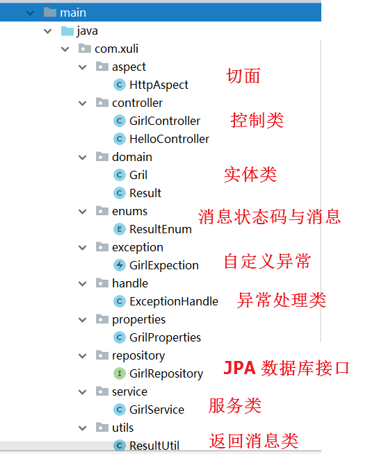
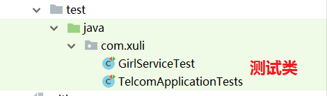
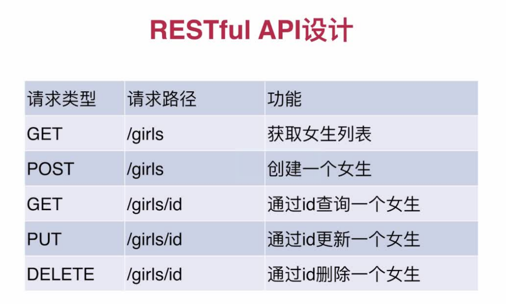
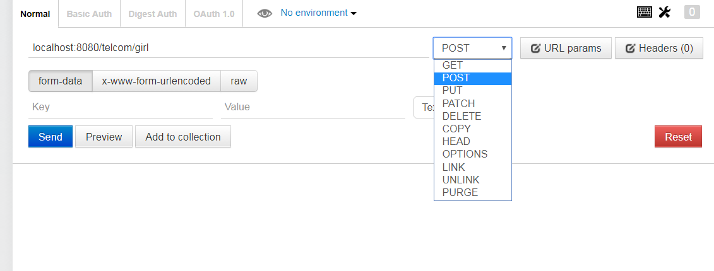

## spring boot 入门 Demo

> 慕课网学习笔记：
> 2小时学会Spring Boot http://www.imooc.com/learn/767
> Spring Boot进阶之Web进阶 http://www.imooc.com/learn/810
> spring boot docs: https://docs.spring.io/spring-boot/docs/current-SNAPSHOT/reference/htmlsingle/

做的是一个girl的增删改查，aop等。
可以作为spring-boot的入门学习案列。

---

### 主要内容：

1. spring boot 介绍
2. 安装
3. 配置
4. Controller 的使用
5. 数据库操作
6. 使用 @Valid 表单验证
7. 使用 AOP 处理请求
8. 统一异常处理
9. 单元测试


---

### spring boot 介绍

+ 化繁为简
+ 备受关注
+ 微服务的入门级框架


### 安装

+ JDK, Maven, IDEA, Mysql 的安装略

**项目结构**





---

### spring boot 配置

**属性文件 application.properties/application.yml 的配置**

Spring Boot的默认属性配置文件是在resources下的application.properties，也可以使用application.yaml来配置默认参数。如果是使用Spring Boot自带的配置的话，配置即使用，无需再单独去声明内容

> 具体的值及意义参见文档
> https://docs.spring.io/spring-boot/docs/1.2.3.RELEASE/reference/html/common-application-properties.html


> 主要的配置有 SPRING CONFIG ，PROFILES，APPLICATION SETTINGS， LOGGING， IDENTITY ， EMBEDDED SERVER CONFIGURATION， SPRING MVC， SPRING RESOURCES HANDLING，SPRING HATEOAS，HTTP encoding，  HTTP message conversion， HTTP response compression，JACKSON ，THYMELEAF ， FREEMARKER ，GROOVY TEMPLATES，VELOCITY TEMPLATES，JERSEY ， INTERNATIONALIZATION ，SECURITY ，DATASOURCE ，DAO ，MONGODB ，JPA ，JTA ，ATOMIKOS，BITRONIX，ELASTICSEARCH ，DATA REST ，FLYWAY ，LIQUIBASE ，JMX，RABBIT ，REDIS ，ACTIVEMQ ，HornetQ ，JMS ，Email ，SPRING BATCH ，AOP，FILE ENCODING ， SPRING SOCIAL， SPRING SOCIAL FACEBOOK，SPRING SOCIAL LINKEDIN，SPRING SOCIAL TWITTER ，SPRING MOBILE SITE PREFERENCE，SPRING MOBILE DEVICE VIEWS，MANAGEMENT HTTP SERVER 等等

**本Demo中的配置属性**

application.properties

```
spring.profiles.active=dev    # 指定配置生效文件，此时为开发时的配置文件
spring.jpa.open-in-view=true   

# JPA 数据源
spring.datasource.driver-class-name=com.mysql.jdbc.Driver
spring.datasource.url=jdbc:mysql://127.0.0.1:3306/dbgirl
spring.datasource.username=root
spring.datasource.password=whirly123


spring.jpa.hibernate.ddl-auto=update    
# 此行配置了实体类维护数据库表结构的具体行为，update表示当实体类的属性发生变化时，表结构跟着更新，这里我们也可以取值create，这个create表示启动的时候删除上一次生成的表，并根据实体类重新生成表，这个时候之前表中的数据就会被清空；还可以取值create-drop，这个表示启动时根据实体类生成表，但是当sessionFactory关闭的时候表会被删除；validate表示启动时验证实体类和数据表是否一致；none表示啥都不做。 

spring.jpa.show-sql=true    # 在控制台显示所执行的 sql 语句
```


application-dev.properties

```
server.port=8080	# tomcat 的端口
server.context-path=/telcom  本项目的根路径

telNum=15805183242  

# 前缀为 girl 的两个变量
girl.cupSize=B  
girl.age=18
```

---

### Controller 的使用

**首先定义一个实体类 Girl**

它有三个属性 id, cupSize, age

**restful 风格的 API 设计**




**Spring Boot 中常用的注解**

| 注解 | 作用 |
|:-- |:-- |
|@SpringBootApplication |包含了@ComponentScan、@Configuration和@EnableAutoConfiguration注解。其中@ComponentScan让Spring Boot扫描到Configuration类并把它加入到程序上下文。 |
| @Configuration | 等同于spring的XML配置文件；使用java代码可以检查类型安全。|
|@EnableAutoConfiguration | 自动配置|
| @ComponentScan| 组件扫描，可自动发现和装配一些Bean|
|@Component | 可配合CommandLineRunner使用，在程序启动后执行一些基础任务|
|@RestController | 是@Controller和@ResponseBody的合集,表示这是个控制器bean,并且是将函数的返回值直 接填入HTTP响应体中,是REST风格的控制器|
|@RequestMapping| 注解提供路由信息|
|@Autowired | 自动导入|
|@PathVariable | 获取参数|
| @JsonBackReference| 解决嵌套外链问题|
|@RepositoryRestResourcepublic | 配合spring-boot-starter-data-rest使用|
|@Bean |主要被用在方法上，来显式声明要用生成的类|
|@Profiles | Spring Profiles提供了一种隔离应用程序配置的方式，并让这些配置只能在特定的环境下生效|


**使用一个方便进行http请求的插件 postman **

可到 chrome 应用商店中安装，之后便可方便地进行各种请求




---

### 数据库操作

JPA是Java Persistence API的简称，中文名Java持久层API，是JDK 5.0注解或XML描述对象－关系表的映射关系，并将运行期的实体对象持久化到数据库中


spring boot 中使用 JPA 首先要添加相关依赖，然后在application.properties中配置数据源和jpa的基本的相关属性

**定义映射实体类 GIRL**

在Project启动时，系统会根据实体类创建相应的数据表

Girl.java 
```
@Entity
public class Gril {

    @Id					// id
    @GeneratedValue		// 字段自增
    private Integer id;

    private String cupSize;


    @Min(value = 18, message = "您输入的年龄小于18！")
    @NotNull(message = "年龄必填。")
    private Integer age;

    public Gril() {
    }

    ... getter() and setter()
}

```


**定义数据访问接口**

```
public interface GirlRepository extends JpaRepository<Gril, Integer>{
}
```
+ 我们继承JpaRepository接口后，我们就自动具备了如下数据访问方法：
```
List<T> findAll();
List<T> findAll(Sort var1);
List<T> findAll(Iterable<ID> var1);
<S extends T> List<S> save(Iterable<S> var1);
void flush();
<S extends T> S saveAndFlush(S var1);
void deleteInBatch(Iterable<T> var1);
void deleteAllInBatch();
T getOne(ID var1);
<S extends T> List<S> findAll(Example<S> var1);
<S extends T> List<S> findAll(Example<S> var1, Sort var2);
```
+ 我们可以在接口中定义查询方法，可以按照属性名来查询，但是方法的命名方式是固定的，比如第一个方法和第二个方法，第一个方法表示根据一个属性查询，第二个方法表示根据多个属性查询，findBy、And等可以算作是这里的查询关键字了，如果写作其他名称则系统不能识别，类似的关键字还有Like、Or、Is、Equals、Between等，而这里的findBy关键字又可以被find、read、readBy、query、queryBy、get、getBy等来代替。

+ 在查询的过程中我们也可以限制查询结果，这里使用的关键字是top、first等，比如查询前10条数据我们可以写作：
List<Person> findFirst10ByName(String name);

+ 使用NamedQuery来查询，就是我们直接在实体类上使用@NamedQuery注解来定义查询方法和方法名，一个名称对应一个查询语句，具体可以参考我们上文的实体类 

+ 我们也可以向第三个方法那样添加@Query注解，当我调用这个方法的时候使用这个注解中的sql语句进行查询，方法的参数则是注解中的占位符的值。


**Controller 类**
我们可以在Controller类中使用 GirlRepository

```
@RestController
public class GirlController {
    private final static Logger logger = LoggerFactory.getLogger(GirlController.class);

    @Autowired
    private GirlRepository girlRepository;

    @Autowired
    private GirlService girlService;

    /**
     * 查询所有数据
     * @return
     */
    @GetMapping(value = "/gril")
    public List<Gril> getGrils(){
        logger.info("getGrils2222222222");
        return girlRepository.findAll();
    }

    /**
     * 新增一条数据
     * @param age
     * @param cupSize
     * @return
     */
    @PostMapping(value = "/addGril")
    public Gril addGril(@RequestParam("age") Integer age, @RequestParam("cupSize") String cupSize){
        Gril gril = new Gril();
        gril.setAge(age);
        gril.setCupSize(cupSize);
        return girlRepository.save(gril);
    }

    /**
     * 新增一条数据,注入表单校验，获得校验结果信息
     * @param gril
     * @return
     */
    @PostMapping(value = "/addGril2")
    public Result addGril2(@Valid Gril gril, BindingResult bindingResult){
        if(bindingResult.hasErrors()){
            return ResultUtil.error(ResultEnum.UNKONW_ERROR.getCode(), bindingResult.getFieldError().getDefaultMessage());
        }
        gril.setAge(gril.getAge());
        gril.setCupSize(gril.getCupSize());
        return ResultUtil.success(girlRepository.save(gril));
    }

    /**
     * 查询单条数据
     * @param id
     * @return
     */
    @GetMapping(value = "/findOne")
    public Gril findOne(@RequestParam("id") Integer id){
        return girlRepository.findOne(id);
    }

    /**
     * 事物的处理
     */
    @PostMapping(value = "/GirlTwo")
    public void GirlTwo(){
        girlService.insertTwo();
    }

    @PostMapping(value = "/getAge/{id}")
    public void getAge(@PathVariable("id") Integer id) throws Exception{
        girlService.getAge(id);

    }
}

```

**在浏览器中使用 postman 插件可以分别测试各个方法**

**事务 - 要么都做，要么都不做**

Springboot内部提供的事务管理器是根据autoconfigure来进行决定的。当使用jpa的时候，Springboot会构造一个JpaTransactionManager这个事务管理器。当我们使用spring-boot-starter-jdbc的时候，构造的事务管理器则是DataSourceTransactionManager。

这2个事务管理器都实现了spring中提供的PlatformTransactionManager接口，这个接口是spring的事务核心接口。

> 参考文档：
> spring transaction源码分析--事务架构 http://www.cnblogs.com/davidwang456/p/4309038.html

	


service\GirlService.java

```
@Service
public class GirlService {
    @Autowired
    private GirlRepository girlRepository;

    @Transactional
    public void insertTwo(){
        Gril girlA = new Gril();
        girlA.setCupSize("A");
        girlA.setAge(18);
        girlRepository.save(girlA);

        Gril girlB = new Gril();
        girlB.setCupSize("Bbb");
        girlB.setAge(192);
        girlRepository.save(girlB);
    }
	...
}
```

----


###　使用 @Valid 表单验证

Bean Validation 1.0（JSR-303）是一个校验规范，在Spring Boot项目由于自带了Hibernate validator 5(http://hibernate.org/validator/)实现，所以我们可以非常方便的使用这个特性 。

**我们在 Girl.java 中的 age 属性中配置最小值和非空**
```
    @Min(value = 18, message = "您输入的年龄小于18！")
    @NotNull(message = "年龄必填。")
    private Integer age;
```

**校验常用的注解如下：**
```
@AssertFalse 校验false
@AssertTrue 校验true
@DecimalMax(value=,inclusive=) 小于等于value，
inclusive=true,是小于等于
@DecimalMin(value=,inclusive=) 与上类似
@Max(value=) 小于等于value
@Min(value=) 大于等于value
@NotNull  检查Null
@Past  检查日期
@Pattern(regex=,flag=)  正则
@Size(min=, max=)  字符串，集合，map限制大小
@Valid 对po实体类进行校验
```

**接着看下如何在Controller层使用**
```
	/**
     * 新增一条数据,注入表单校验，获得校验结果信息
     * @param gril
     * @return
     */
    @PostMapping(value = "/addGril2")
    public Result addGril2(@Valid Gril gril, BindingResult bindingResult){
        if(bindingResult.hasErrors()){
            return ResultUtil.error(ResultEnum.UNKONW_ERROR.getCode(), bindingResult.getFieldError().getDefaultMessage());
        }
        gril.setAge(gril.getAge());
        gril.setCupSize(gril.getCupSize());
        return ResultUtil.success(girlRepository.save(gril));
    }
```
@Valid 指明要校验的字段
BindingResult bindingResult 存储校验结果


----

### 使用 AOP 处理请求

面向切面（AOP）Aspect Oriented Programming是一种编程范式，与语言无关，是一种程序设计思想，它也是spring的两大核心之一

**创建一个处理文件，在类上添加@Aspect注解，再用@Component将类加入到spring容器中去**

AOP是Spring框架中的一个重要内容，它通过对既有程序定义一个切入点，然后在其前后切入不同的执行内容，比如常见的有：打开数据库连接/关闭数据库连接、打开事务/关闭事务、记录日志等。

基于AOP不会破坏原来程序逻辑，因此它可以很好的对业务逻辑的各个部分进行隔离，从而使得业务逻辑各部分之间的耦合度降低，提高程序的可重用性，同时提高了开发的效率。

aspect\HttpAspect.java
```
@Aspect
@Component
public class HttpAspect {

    private final static Logger logger = LoggerFactory.getLogger(HttpAspect.class);
    /**
     * 共用方法，面向切面方法
     */
    @Pointcut("execution(public * com.xuli.controller.GirlController.*(..))")
    public void log(){

    }

    /**
     * 控制层执行之前执行doBefore
     */
    @Before("log()")
    public void doBefore(JoinPoint joinPoint){
        logger.info("1111111111");

        ServletRequestAttributes attributes = (ServletRequestAttributes)RequestContextHolder.getRequestAttributes();
        HttpServletRequest request = attributes.getRequest();
        // url
        logger.info("url={}", request.getRequestURL());
        // method
        logger.info("method={}", request.getMethod());
        // ip
        logger.info("id={}", request.getRemoteAddr());
        // 类方法
        logger.info("class_Method={}", joinPoint.getSignature().getDeclaringTypeName()+'.'+joinPoint.getSignature().getName() );
        // 参数
        logger.info("args={}", joinPoint.getArgs());
    }

    /**
     * 控制层执行结束后执行doAfter
     */
    @After("log()")
    public void doAfter(){
        logger.info("2222222222");
    }

    /**
     * 执行结束后返回的结果打印出来
     * @param object
     */
    @AfterReturning(returning = "object", pointcut = "log()")
    public void doAfterReturn(Object object){
//        logger.info("response={}", object.toString());
    }
}
```
**实现AOP的切面主要有以下几个要素：**

+ 使用@Aspect注解将一个java类定义为切面类
+ 使用@Pointcut定义一个切入点，可以是一个规则表达式，比如下例中某个package下的所有函数，也可以是一个注解等。
+ 根据需要在切入点不同位置的切入内容
+ 使用@Before在切入点开始处切入内容
+ 使用@After在切入点结尾处切入内容
+ 使用@AfterReturning在切入点return内容之后切入内容（可以用来对处理返回值做一些加工处理）
+ 使用@Around在切入点前后切入内容，并自己控制何时执行切入点自身的内容
+ 使用@AfterThrowing用来处理当切入内容部分抛出异常之后的处理逻辑

---

### 统一异常处理

**返回消息的状态码**

为了避免状态码和消息对应失误，我们定义一个状态码Enum类来管理状态码

enums\ResultEnum.java
```
public enum ResultEnum {
    UNKONW_ERROR(-1, "未知错误"),
    SUCCESS(0, "成功"),
    PRIMARY_SCHOOL(100, "你可能还在上小学吧"),
    MIDDLE_SCHOOL(101,"你可能在上初中"),

    ;
    private  Integer code;
    private String msg;

    ResultEnum(Integer code, String msg) {
        this.code = code;
        this.msg = msg;
    }

    public Integer getCode() {
        return code;
    }

    public String getMsg() {
        return msg;
    }

    public void setCode(Integer code) {
        this.code = code;
    }

    public void setMsg(String msg) {
        this.msg = msg;
    }
}
```


**统一消息返回的格式**
为了统一执行成功和执行异常是的消息返回格式，我们定义一个消息实体类和消息工具类


domain\Result.java

```
public class Result<T> {
    /** 错误码。 */
    private Integer code;

    /** 提示信息。 */
    private String msg;

    /** 具体内容。 */
    private T data;

    public Integer getCode() {
        return code;
    }

    public void setCode(Integer code) {
        this.code = code;
    }

    public String getMsg() {
        return msg;
    }

    public void setMsg(String msg) {
        this.msg = msg;
    }

    public T getData() {
        return data;
    }

    public void setData(T data) {
        this.data = data;
    }
}
```

utils\ResultUtil.java

```
public class ResultUtil {
    /**
     * 共通方法：成功的情况
     * @param object
     * @return
     */
    public static Result success(Object object){
        Result result = new Result();
        result.setCode(0);
        result.setMsg("成功");
        result.setData(object);
        return result;
    }

    /**
     * 共通方法：成功的情况，data是null
     * @return
     */
    public static Result success(){
        return success(null);
    }

    /**
     * 共通方法：失败的情况
     * @param code
     * @param msg
     * @return
     */
    public static Result error(Integer code, String msg){
        Result result = new Result();
        result.setCode(code);
        result.setMsg(msg);
        return result;
    }
}

```

**自定义异常和异常处理**

---

### 单元测试

Spring测试框架提供MockMvc对象，可以在不需要客户端-服务端请求的情况下进行MVC测试，完全在服务端这边就可以执行Controller的请求，跟启动了测试服务器一样。

测试开始之前需要建立测试环境，setup方法被@Before修饰。通过MockMvcBuilders工具，使用WebApplicationContext对象作为参数，创建一个MockMvc对象。

MockMvc对象提供一组工具函数用来执行assert判断，都是针对web请求的判断，这组工具的使用方式是函数的链式调用，允许程序员将多个测试用例链接在一起，并进行多个判断。

```
@RunWith(SpringRunner.class)
@SpringBootTest
public class GirlServiceTest {
    @Autowired
    private GirlService girlService;

    @Test
    @Transactional
    public void findOneTest(){
        Gril gril = girlService.findOneGirl(15);
        Assert.assertEquals(new Integer(5), gril.getAge());
    }
}
```