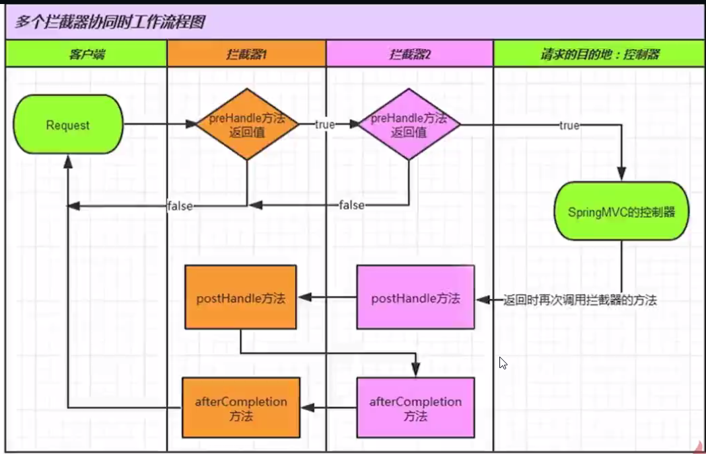

## spring mvc 拦截器

## 什么是拦截器

拦截器是指通过统一拦截从浏览器到服务器的请求来完成功能的增强

使用场景：解决请求的共性问题（如：乱码问题，权限检验问题等）


拦截器的基本工作原理：SpringMvc 可以通过配置过滤器来解决乱码问题，拦截器的工作原理和过滤器非常相似。

### 拦截器的方法介绍

1、 preHandle方法：在请求处理之前进行调用
2、 postHandle方法：在请求**处理之后**进行调用
3、 afterCompletion方法：在请求**结束之后**才进行调用


### 有多个拦截器时的调用过程




### 使用
首先需要配置web.xml

```

    <context-param>
        <param-name>contextConfigLocation</param-name>
        <!-- 扫描spring 配置文件 -->
        <param-value>/WEB-INF/applicationContext.xml</param-value>
    </context-param>
    <listener>
        <listener-class>org.springframework.web.context.ContextLoaderListener</listener-class>
    </listener>
    <servlet>
        <servlet-name>dispatcher</servlet-name>
        <!-- 使用这个类过滤所有请求 -->
        <servlet-class>org.springframework.web.servlet.DispatcherServlet</servlet-class>
        <load-on-startup>1</load-on-startup>
    </servlet>
    <servlet-mapping>
        <servlet-name>dispatcher</servlet-name>
        <url-pattern>*.form</url-pattern>
    </servlet-mapping>
```

编写第一个拦截器类 Test1Interceptor.java
```
package com.imooc.test.interceptor;

import org.springframework.web.servlet.HandlerInterceptor;
import org.springframework.web.servlet.ModelAndView;

import javax.servlet.http.HttpServletRequest;
import javax.servlet.http.HttpServletResponse;

/**
 * 编写拦截器类实现HandlerInterceptor接口
 * Created by mike on 2016/8/5.
 */
public class Test1Interceptor implements HandlerInterceptor {
    /**
     * 当用户没有登录的时候终止请求
     * 返回值：是否将当前的请求拦截下来
     * @param httpServletRequest
     * @param httpServletResponse
     * @param o
     * @return 如果返回false，请求将被终止，如果返回为true，请求继续运行
     * @throws Exception
     */
    @Override
    public boolean preHandle(HttpServletRequest httpServletRequest, HttpServletResponse httpServletResponse, Object o) throws Exception {
        httpServletRequest.setCharacterEncoding("utf-8");
        System.out.println("执行到了preHandle方法");

        //对用户登录进行判断
        if (httpServletRequest.getSession().getAttribute("user")==null){
            httpServletRequest.getRequestDispatcher("login.jsp").forward(httpServletRequest,httpServletResponse);
            return false;
        }

        return true;
    }

    @Override
    public void postHandle(HttpServletRequest httpServletRequest, HttpServletResponse httpServletResponse, Object o, ModelAndView modelAndView) throws Exception {
        System.out.println("执行到了postHandle方法");
        //可以通过ModelAndView参数来改变显示的视图
        //或修改发往视图的方法
    }

    @Override
    public void afterCompletion(HttpServletRequest httpServletRequest, HttpServletResponse httpServletResponse, Object o, Exception e) throws Exception {
        System.out.println("执行到了afterCompletion方法");
    }
}

```

编写第二个拦截器类 Test2Interceptor

```
package com.imooc.test.interceptor;

import org.springframework.ui.ModelMap;
import org.springframework.web.context.request.WebRequest;
import org.springframework.web.context.request.WebRequestInterceptor;
import org.springframework.web.servlet.HandlerInterceptor;
import org.springframework.web.servlet.ModelAndView;

import javax.servlet.http.HttpServletRequest;
import javax.servlet.http.HttpServletResponse;

/**
 * 编写拦截器类实现WebRequestInterceptor接口
 * Created by mike on 2016/8/5.
 */
public class Test2Interceptor implements WebRequestInterceptor {

    @Override
    public void preHandle(WebRequest webRequest) throws Exception {

    }

    @Override
    public void postHandle(WebRequest webRequest, ModelMap modelMap) throws Exception {

    }

    @Override
    public void afterCompletion(WebRequest webRequest, Exception e) throws Exception {

    }
}

```

为了让拦截器生效，需要配置一下 dispatcher-servlet.xml

```
<?xml version="1.0" encoding="UTF-8"?>
<beans xmlns="http://www.springframework.org/schema/beans"
       xmlns:xsi="http://www.w3.org/2001/XMLSchema-instance"
       xmlns:context="http://www.springframework.org/schema/context"
       xmlns:aop="http://www.springframework.org/schema/aop"
       xmlns:mvc="http://www.springframework.org/schema/mvc"
       xmlns:tx="http://www.springframework.org/schema/tx"

       xsi:schemaLocation="http://www.springframework.org/schema/beans
       http://www.springframework.org/schema/beans/spring-beans-4.3.xsd
       http://www.springframework.org/schema/context
       http://www.springframework.org/schema/context/spring-context-4.3.xsd
       http://www.springframework.org/schema/aop
       http://www.springframework.org/schema/aop/spring-aop-4.3.xsd
       http://www.springframework.org/schema/mvc
       http://www.springframework.org/schema/mvc/spring-mvc-4.3.xsd
       http://www.springframework.org/schema/tx
       http://www.springframework.org/schema/tx/spring-tx-4.3.xsd">

    <context:component-scan base-package="com.imooc"/>

    <!--注册拦截器-->
    <mvc:interceptors>
        <bean class="com.imooc.test.interceptor.Test1Interceptor"></bean>
        <bean class="com.imooc.test.interceptor.Test2Interceptor"></bean>
    </mvc:interceptors>

</beans>
```

编写 controller 测试
```
package com.imooc.test.interceptor;

import org.springframework.stereotype.Controller;
import org.springframework.web.bind.annotation.RequestMapping;
import org.springframework.web.portlet.ModelAndView;

/**
 * Created by mike on 2016/8/5.
 */
@Controller
@RequestMapping("/")
public class TestController {

    @RequestMapping("/viewAll")
    public ModelAndView viewAll(String name,String pwd){
        ModelAndView mv=new ModelAndView();
        System.out.println("进入控制器viewAll方法...");
        System.out.println("name="+name);
        System.out.println("password="+pwd);
        mv.setViewName("/hello1.jsp");
        mv.addObject("msg","从ViewAll方法传回视图的数据！");
        return mv;
    }

    @RequestMapping("/query")
    public ModelAndView query(String name,String pwd){
        ModelAndView mv=new ModelAndView();
        System.out.println("进入控制器query方法...");
        System.out.println("name="+name);
        System.out.println("password="+pwd);
        mv.setViewName("hello1.jsp");
        return mv;
    }
}

```

### 拦截器的其他实现方式
拦截器的类还可以通过WebRequestInterceptor接口来编写向springMvc框架注册的写法不变

弊端：preHandle没有返回值，不能终止请求

### 拦截器和过滤器的区别

过滤器Filter依赖于Servlet容器，基于回调函数，过滤范围大

拦截器Interceptor依赖于框架容器，基于反射机制，只过滤请求
